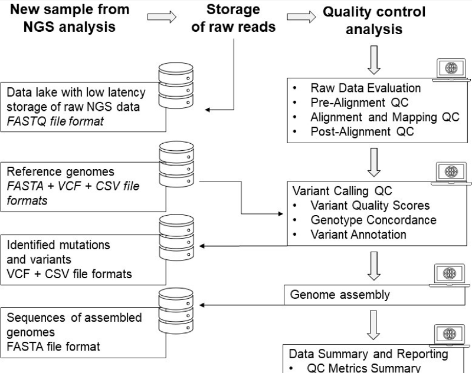
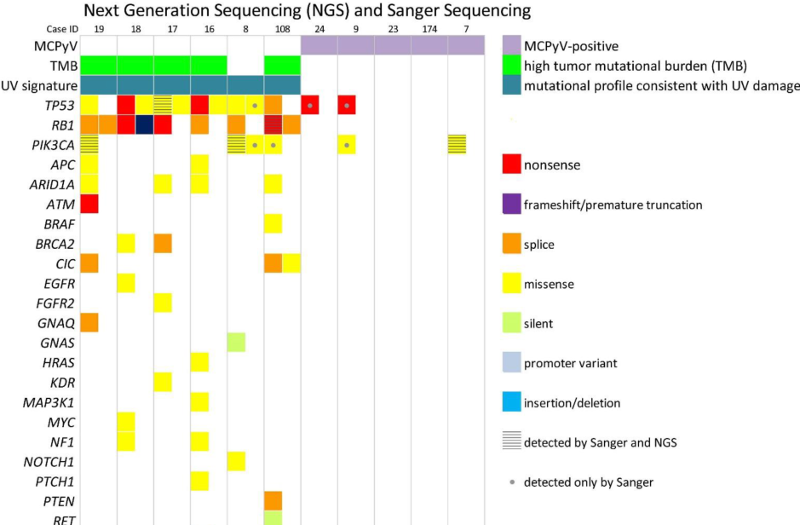

# MI²~~Cancer~~ {.unnumbered #mi2cancer}

#### 2024 {-}

How the xLungs project is developed? (polish only)

<iframe width="560" height="315" src="https://www.youtube.com/embed/lqQxIpKFxWU?si=kOIrgZcdxJw7Nckh" title="YouTube video player" frameborder="0" allow="accelerometer; autoplay; clipboard-write; encrypted-media; gyroscope; picture-in-picture; web-share" referrerpolicy="strict-origin-when-cross-origin" allowfullscreen></iframe>

<a href="https://arxiv.org/abs/2407.07514">Swin SMT: Global Sequential Modeling in 3D Medical Image Segmentation</a>

Szymon Płotka, Maciej Chrabaszcz, Przemyslaw Biecek

<strong>MICCAI (2024)</strong>

We introduce Swin Soft Mixture Transformer (Swin SMT), a novel architecture based on Swin UNETR, which incorporates a Soft Mixture-of-Experts (Soft MoE) to effectively handle complex and diverse long-range dependencies. The use of Soft MoE allows for scaling up model parameters maintaining a balance between computational complexity and segmentation performance in both training and inference modes. Comprehensive experimental results demonstrate that Swin SMT outperforms several state-of-the-art methods in 3D anatomical structure segmentation.

#### 2023 {-}

<a href="https://www.sciencedirect.com/science/article/pii/S0959804922004658">Machine learning models demonstrate that clinicopathologic variables are comparable to gene expression prognostic signature in predicting survival in uveal melanoma</a>

Piotr Donizy, Mateusz Krzyzinski, Anna Markiewicz, Pawel Karpinski, Krzysztof Kotowski, Artur Kowalik, Jolanta Orlowska-Heitzman, Bozena Romanowska-Dixon, Przemyslaw Biecek, Mai P. Hoang 

<strong>European Journal of Cancer (2023)</strong>

Molecular assays are not accessible to all uveal melanoma patients. We investigate machine learning models on clinicopathologic variables for risk stratification. Machine learning models included random survival forest and survival gradient boosting. They performed similarly or better than gene expression prognostic signature. Readily accessible clinicopathologic variables can provide adequate prognostic information.

<a href="https://openaccess.thecvf.com/content/CVPR2023W/XAI4CV/html/Komorowski_Towards_Evaluating_Explanations_of_Vision_Transformers_for_Medical_Imaging_CVPRW_2023_paper.html">Towards Evaluating Explanations of Vision Transformers for Medical Imaging</a>

Piotr Komorowski, Hubert Baniecki, Przemysław Biecek

<strong>CVPR Workshop on Explainable AI for Computer Vision (2023)</strong>

This paper investigates the performance of various interpretation methods on a Vision Transformer (ViT) applied to classify chest X-ray images. We introduce the notion of evaluating faithfulness, sensitivity, and complexity of ViT explanations. The obtained results indicate that Layerwise relevance propagation for transformers outperforms Local interpretable model-agnostic explanations and Attention visualization, providing a more accurate and reliable representation of what a ViT has actually learned.

<a href="https://bjo.bmj.com/content/early/2023/09/21/bjo-2023-323816.abstract">Ki67 is a better marker than PRAME in risk stratification of BAP1-positive and BAP1-loss uveal melanomas</a>

 Piotr Donizy, Mikołaj Spytek, Mateusz Krzyziński, Krzysztof Kotowski, Anna Markiewicz, Bozena Romanowska-Dixon, Przemyslaw Biecek, Mai P Hoang

<strong>British Journal of Ophthalmology (2023)</strong>

Accurate risk stratification of uveal melanoma (UM) patients is important for determining the interval and frequency of surveillance. Loss of BAP1 expression has been shown to be strongly associated with UM-related death and metastasis.
In this study of 164 enucleated UMs, we assessed the prognostic role of preferentially expressed antigen in melanoma (PRAME) expression and Ki67 proliferation index measured by digital quantitation using QuPath programme in patients with BAP1-positive and BAP1-loss UMs.

<a href="https://www.mdpi.com/2072-6694/14/2/439">A Signature of 14 Long Non-Coding RNAs (lncRNAs) as a Step towards Precision Diagnosis for NSCLC</a>

Anetta Sulewska, Jacek Niklinski, Radoslaw Charkiewicz, Piotr Karabowicz, Przemyslaw Biecek, Hubert Baniecki, Oksana Kowalczuk, Miroslaw Kozlowski, Patrycja Modzelewska, Piotr Majewski, Elzbieta Tryniszewska, Joanna Reszec, Zofia Dzieciol-Anikiej, Cezary Piwkowski, Robert Gryczka, Rodryg Ramlau 

<strong>Cancers (2023)</strong>

Although the biological function of lncRNAs has not been fully elucidated, we know that the aberrant expression of lncRNAs can drive the cancer phenotype. Therefore, a growing area of research is focusing on lncRNAs as putative diagnostic biomarkers and therapeutic targets. The aim of the study was the appraisal of the diagnostic value of 14 differentially expressed lncRNA in the early stages of NSCLC. We established two classifiers. The first recognized cancerous from noncancerous tissues, the second successfully discriminated NSCLC subtypes (LUAD vs. LUSC). Our results indicate that the panel of 14 lncRNAs can be a promising tool to support a routine histopathological diagnosis of NSCLC.

<a href="https://www.mdpi.com/2072-6694/15/14/3742">Applied Molecular-Based Quality Control of Biobanked Samples for Multi-Omics Approach</a>

Anna Michalska-Falkowska, Jacek Niklinski, Hartmut Juhl, Anetta Sulewska, Joanna Kisluk, Radoslaw Charkiewicz, Michal Ciborowski, Rodryg Ramlau, Robert Gryczka, Cezary Piwkowski, Miroslaw Kozlowski, Borys Miskiewicz, Przemyslaw Biecek, Karolina Wnorowska, Zofia Dzieciol-Anikiej, Karine Sargsyan, Wojciech Naumnik, Robert Mroz, Joanna Reszec-Gielazyn

<strong>Cancers (2023)</strong>

This study highlights the significance of quality assurance in biobanking facilities, specifically in the context of high-throughput research and novel molecular techniques. We established specific quality management workflows utilizing biospecimens collected from oncological patients in Polish clinics

<a href="https://www.mdpi.com/2072-6694/13/7/1621">Merkel Cell Carcinoma of Unknown Primary: Immunohistochemical and Molecular Analyses Reveal Distinct UV-Signatures</a>

Piotr Donizy, Joanna Wróblewska, Dora Dias-Santagata, Katarzyna Woznica, Przemyslaw Biecek, Mark Mochel, Cheng-Lin Wu, Janusz Kopczynski, Malgorzata Pieniazek, Janusz Ryś, Andrzej Marszalek, Mai Hoang

<strong>Cancers (2023)</strong>

Similar to primary cutaneous Merkel cell carcinomas, virus-negative unknown primary tumors exhibited UV signatures and frequent high tumor mutational burdens, whereas few molecular alterations were noted in virus-positive tumors. Although additional studies are warranted for the virus-positive cases, our findings are supportive of a cutaneous metastatic origin for virus-negative Merkel cell carcinomas of unknown primary.

<a href="https://www.mdpi.com/1422-0067/24/19/14699">miRNA Studies in Glaucoma: A Comprehensive Review of Current Knowledge and Future Perspectives</a>

Margarita Dobrzycka, Anetta Sulewska, Przemyslaw Biecek, Radoslaw Charkiewicz, Piotr Karabowicz, Angelika Charkiewicz, Kinga Golaszewska, Patrycja Milewska, Anna Michalska-Falkowska, Karolina Nowak, Jacek Niklinski, Joanna Konopińska 

<strong>International Journal of Molecular Sciences (2023)</strong>

miRNA research in glaucoma has provided significant insights into the molecular mechanisms of the disease, offering potential biomarkers, diagnostic tools, and therapeutic targets. However, addressing challenges such as variability and limited tissue accessibility is essential, and further investigations and validation will contribute to a deeper understanding of the functional significance of miRNAs in glaucoma.

<a href="https://doi.org/10.1007/978-3-031-34344-5_9">Hospital Length of Stay Prediction Based on Multi-modal Data towards Trustworthy Human-AI Collaboration in Radiomics</a>

Hubert Baniecki, Bartlomiej Sobieski, Przemysław Bombiński, Patryk Szatkowski, Przemysław Biecek

<strong>International Conference on Artificial Intelligence in Medicine (2023)</strong>

To what extent can the patient's length of stay in a hospital be predicted using only an X-ray image? We answer this question by comparing the performance of machine learning survival models on a novel multi-modal dataset created from 1235 images with textual radiology reports annotated by humans. We introduce time-dependent model explanations into the human-AI decision making process. For reproducibility, we open-source code and the TLOS dataset at <a href="https://github.com/mi2datalab/xlungs-trustworthy-los-prediction">this URL</a>.

#### 2022 {-}

<a href="https://www.mdpi.com/2072-6694/14/11/2753">Amelanotic Uveal Melanomas Evaluated by Indirect Ophthalmoscopy Reveal Better Long-Term Prognosis Than Pigmented Primary Tumours—A Single Centre Experience</a>

Anna Markiewicz, Piotr Donizy, Monika Nowa, Mateusz Krzyziński, Martyna Elas, Przemysław Płonka, Jolanta Orłowska-Heitzmann, Przemysław Biecek, Mai P. Hoang, Bożena Romanowska-Dixon

<strong>Cancers (2022)</strong>

Patients with amelanotic uveal melanomas (those without pigment) lived longer and the eventual spread of the neoplastic process occurred later than in patients with heavily pigmented tumours. In heavily pigmented uveal melanomas, we found features on histopathological examination that were associated with an unfavourable prognosis. In the two separate groups of uveal melanomas with different degrees of pigmentation, we observed that amelanotic tumours with a lower clinical stage had the best prognosis.

#### 2021 {-}

<a href="https://drive.google.com/file/d/1-B5T3FCAHzDJbOaPtBnf5l9NnK-yhJtZ/view">Prevention is better than cure: a
case study of the abnormalities detection in the chest</a>

Weronika Hryniewska, Piotr Czarnecki, Jakub Wiśniewski, Przemysław Bombiński, Przemysław Biecek

<strong>CVPR Workshop on “Beyond Fairness: Towards a Just, Equitable, and Accountable Computer Vision” (2021)</strong>

In this paper, we analyze in detail a single use case - a Kaggle competition related to the detection of abnormalities in X-ray lung images. We demonstrate how a series of simple tests for data imbalance exposes faults in the data acquisition and annotation process. Complex models are able to learn such artifacts and it is difficult to remove this bias during or after the training.

#### 2017 {-}

<a href="https://www.ncbi.nlm.nih.gov/pmc/articles/PMC5669876/">Molecular chaperones in the acquisition of cancer cell chemoresistance with mutated TP53 and MDM2 up-regulation</a>

Zuzanna Tracz-Gaszewska, Marta Klimczak, Przemyslaw Biecek, Marcin Herok, Marcin Kosinski, Maciej Olszewski, Patrycja Czerwińska, Milena Wiech, Maciej Wiznerowicz, Alicja Zylicz, Maciej Zylicz, Bartosz Wawrzynow 

<strong>Oncotarget (2017)</strong>

Utilizing the TCGA PANCAN12 dataset we discovered that cancer patients with mutations in TP53 tumor suppressor and overexpression of MDM2 oncogene exhibited decreased survival post treatment.  Our findings demonstrate that molecular chaperones aid cancer cells in surviving the cytotoxic effect of chemotherapeutics and may have therapeutic implications.

