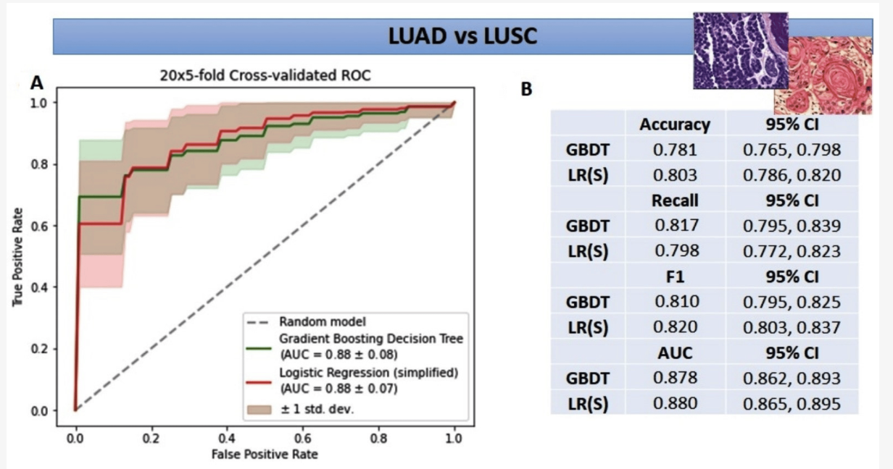
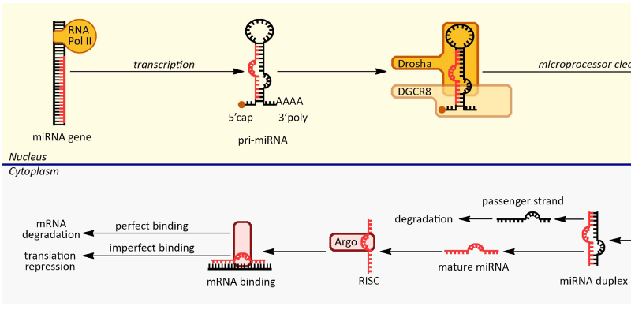

# MI²~~Cancer~~ {-}

<h2 id="removeme">Papers</h2>

<a href="https://www.sciencedirect.com/science/article/pii/S0959804922004658">Machine learning models demonstrate that clinicopathologic variables are comparable to gene expression prognostic signature in predicting survival in uveal melanoma</a>

Piotr Donizy, Mateusz Krzyzinski, Anna Markiewicz, Pawel Karpinski, Krzysztof Kotowski, Artur Kowalik, Jolanta Orlowska-Heitzman, Bozena Romanowska-Dixon, Przemyslaw Biecek, Mai P. Hoang 

<strong>European Journal of Cancer (2023)</strong>

Molecular assays are not accessible to all uveal melanoma patients. We investigate machine learning models on clinicopathologic variables for risk stratification. Machine learning models included random survival forest and survival gradient boosting. They performed similarly or better than gene expression prognostic signature. Readily accessible clinicopathologic variables can provide adequate prognostic information.

<a href="https://bjo.bmj.com/content/early/2023/09/21/bjo-2023-323816.abstract">Ki67 is a better marker than PRAME in risk stratification of BAP1-positive and BAP1-loss uveal melanomas</a>

 Piotr Donizy, Mikołaj Spytek, Mateusz Krzyziński, Krzysztof Kotowski, Anna Markiewicz, Bozena Romanowska-Dixon, Przemyslaw Biecek, Mai P Hoang

<strong>British Journal of Ophthalmology (2023)</strong>

Accurate risk stratification of uveal melanoma (UM) patients is important for determining the interval and frequency of surveillance. Loss of BAP1 expression has been shown to be strongly associated with UM-related death and metastasis.
In this study of 164 enucleated UMs, we assessed the prognostic role of preferentially expressed antigen in melanoma (PRAME) expression and Ki67 proliferation index measured by digital quantitation using QuPath programme in patients with BAP1-positive and BAP1-loss UMs.

<a href="https://www.mdpi.com/2072-6694/14/2/439">A Signature of 14 Long Non-Coding RNAs (lncRNAs) as a Step towards Precision Diagnosis for NSCLC</a>

Anetta Sulewska, Jacek Niklinski, Radoslaw Charkiewicz, Piotr Karabowicz, Przemyslaw Biecek, Hubert Baniecki, Oksana Kowalczuk, Miroslaw Kozlowski, Patrycja Modzelewska, Piotr Majewski, Elzbieta Tryniszewska, Joanna Reszec, Zofia Dzieciol-Anikiej, Cezary Piwkowski, Robert Gryczka, Rodryg Ramlau 

<strong>Cancers (2023)</strong>

Although the biological function of lncRNAs has not been fully elucidated, we know that the aberrant expression of lncRNAs can drive the cancer phenotype. Therefore, a growing area of research is focusing on lncRNAs as putative diagnostic biomarkers and therapeutic targets. The aim of the study was the appraisal of the diagnostic value of 14 differentially expressed lncRNA in the early stages of NSCLC. We established two classifiers. The first recognized cancerous from noncancerous tissues, the second successfully discriminated NSCLC subtypes (LUAD vs. LUSC). Our results indicate that the panel of 14 lncRNAs can be a promising tool to support a routine histopathological diagnosis of NSCLC.

<a href="https://www.mdpi.com/2072-6694/14/11/2753">Amelanotic Uveal Melanomas Evaluated by Indirect Ophthalmoscopy Reveal Better Long-Term Prognosis Than Pigmented Primary Tumours—A Single Centre Experience</a>

Anna Markiewicz, Piotr Donizy, Monika Nowa, Mateusz Krzyziński, Martyna Elas, Przemysław Płonka, Jolanta Orłowska-Heitzmann, Przemysław Biecek, Mai P. Hoang, Bożena Romanowska-Dixon

<strong>Cancers (2022)</strong>

Patients with amelanotic uveal melanomas (those without pigment) lived longer and the eventual spread of the neoplastic process occurred later than in patients with heavily pigmented tumours. In heavily pigmented uveal melanomas, we found features on histopathological examination that were associated with an unfavourable prognosis. In the two separate groups of uveal melanomas with different degrees of pigmentation, we observed that amelanotic tumours with a lower clinical stage had the best prognosis.

<a href="https://www.mdpi.com/1422-0067/24/19/14699">miRNA Studies in Glaucoma: A Comprehensive Review of Current Knowledge and Future Perspectives</a>

Margarita Dobrzycka, Anetta Sulewska, Przemyslaw Biecek, Radoslaw Charkiewicz, Piotr Karabowicz, Angelika Charkiewicz, Kinga Golaszewska, Patrycja Milewska, Anna Michalska-Falkowska, Karolina Nowak, Jacek Niklinski, Joanna Konopińska 

<strong>International Journal of Molecular Sciences (2023)</strong>

miRNA research in glaucoma has provided significant insights into the molecular mechanisms of the disease, offering potential biomarkers, diagnostic tools, and therapeutic targets. However, addressing challenges such as variability and limited tissue accessibility is essential, and further investigations and validation will contribute to a deeper understanding of the functional significance of miRNAs in glaucoma.

<a href="https://www.ncbi.nlm.nih.gov/pmc/articles/PMC5669876/">Molecular chaperones in the acquisition of cancer cell chemoresistance with mutated TP53 and MDM2 up-regulation</a>

Zuzanna Tracz-Gaszewska, Marta Klimczak, Przemyslaw Biecek, Marcin Herok, Marcin Kosinski, Maciej Olszewski, Patrycja Czerwińska, Milena Wiech, Maciej Wiznerowicz, Alicja Zylicz, Maciej Zylicz, Bartosz Wawrzynow 

<strong>Oncotarget (2017)</strong>

Utilizing the TCGA PANCAN12 dataset we discovered that cancer patients with mutations in TP53 tumor suppressor and overexpression of MDM2 oncogene exhibited decreased survival post treatment.  Our findings demonstrate that molecular chaperones aid cancer cells in surviving the cytotoxic effect of chemotherapeutics and may have therapeutic implications.

