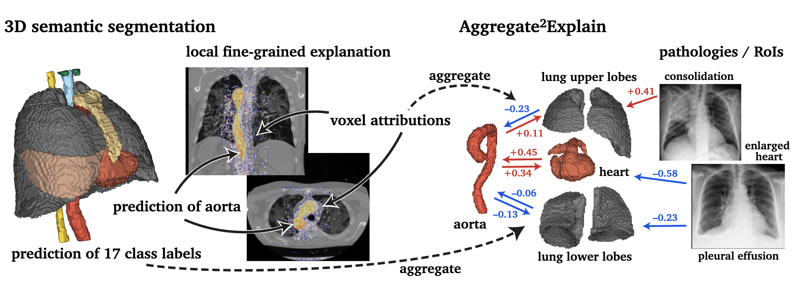
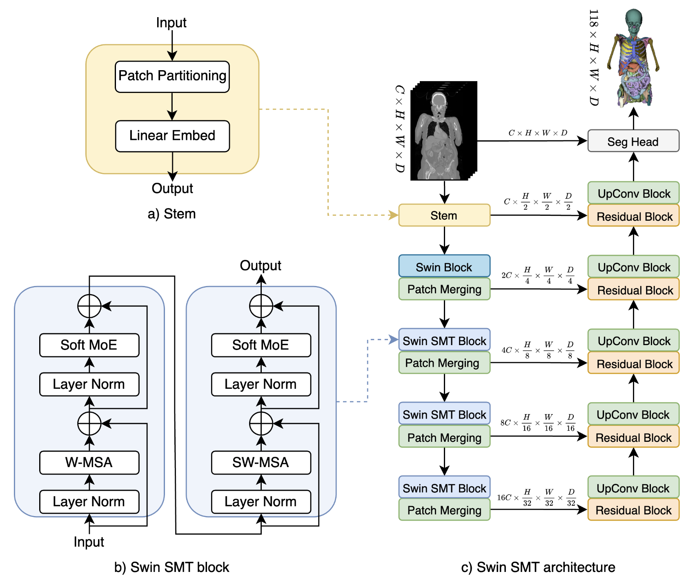
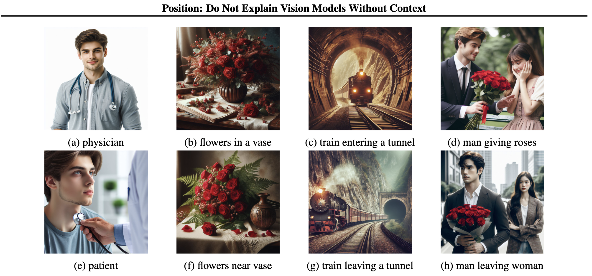
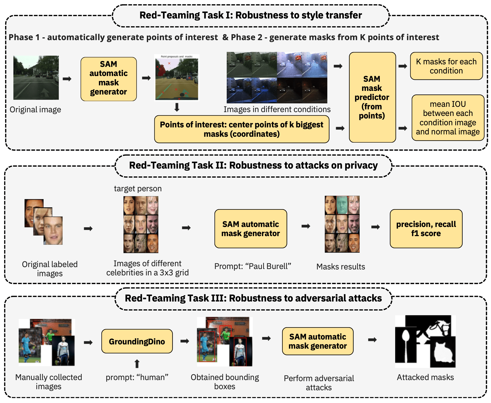

```{r setup, include=FALSE}
options(
  htmltools.dir.version = FALSE, formatR.indent = 2, width = 55, digits = 4
)
output <- knitr::opts_knit$get("rmarkdown.pandoc.to")
is.html = !is.null(output) && output == "html"
```

# MI².AI {.unnumbered #mi2ai}
<script>
document.body.classList.add("index-page")
</script>

On a mission to responsibly build <br/>machine learning predictive models.

MI².AI is a group of mathematicians and computer scientists who love to play with predictive models.
We are spread between [Warsaw University of Technology](https://www.pw.edu.pl/engpw) and [University of Warsaw](https://en.uw.edu.pl). Here we have workshops and seminars, here we are forging new ideas, creating tools, solving problems, doing consulting and sharing our positive attitude. Feel free to jump in. 

#### Mission {-}

Machine learning is like atomic energy. **We develop leaders, skills, methods, tools and good practices so that predictive models can be deployed responsibly and sustainably**.

#### Vision {-}

MI² is a group of experts supporting global initiatives aimed at responsible and sustainable machine learning. We support the development of future leaders of responsible machine learning through internships, PhDs, postdoctoral fellowships and so on. We seek for research grants and business projects to conduct both scientific and applied research. We develop and maintain the software and infrastructure necessary to build responsible and sustainable ML. We develop cooperation with international teams working on similar topics. We support companies to implement best practices related to responsible modelling in their operation. We conduct workshops and training on responsible predictive modelling.


## The Team  {-}
<script>
document.querySelector(".page-inner section > *:first-child").classList.add("team-layout")
document.body.classList.add("team-page")
document.body.classList.add("two-columns")

 $(function() {
      // Thanks to Mark Avery
      // http://stackoverflow.com/questions/8191015/how-do-i-lay-out-my-content-divs-in-a-similar-manner-to-facebook-timeline
      var adjustArticleHeights = (function () {

        var leftColumnHeight = 0,
          rightColumnHeight = 0,
          $articles = $('.masonry > *');

        for (var i = 0; i < $articles.length; i++) {

          if (leftColumnHeight > rightColumnHeight) {
            rightColumnHeight += $articles.eq(i).addClass('right').outerHeight(true);
          } else {
            leftColumnHeight += $articles.eq(i).outerHeight(true);
          }
        }

        return $articles;
      })();
    });
</script>

<div id="team-cover-img"></div>

#### Members {-}

* [Przemysław Biecek](the-team.html#przemysław-biecek), PhD, DSc (Team Leader)
* [Hubert Baniecki](the-team.html#hubert-baniecki), PhD student
* [Mustafa Cavus](the-team.html#mustafa-cavus), PhD
* [Maciej Chrabąszcz](the-team.html#maciej-chrabąszcz), PhD student
* [Weronika Hryniewska-Guzik](the-team.html#weronika-hryniewska-guzik), PhD student
* [Agata Kaczmarek](the-team.html#agata-kaczmarek), MSc student
* [Filip Kołodziejczyk](the-team.html#filip-kołodziejczyk), MSc student
* [Mateusz Krzyziński](the-team.html#mateusz-krzyziński), MSc student
* [Tymoteusz Kwieciński](the-team.html#tymoteusz-kwiecinski), BSc student
* [Stanisław Łaniewski](the-team.html#stanisław-łaniewski), PhD student
* [Wiktoria Mieleszczenko-Kowszewicz](the-team.html#wiktoria-mieleszczenko-kowszewicz), PhD
* [Nuno Sepúlveda](https://www.immune-stats.net), PhD
* [Bartek Sobieski](the-team.html#bartek-sobieski), MSc student
* [Mikołaj Spytek](the-team.html#mikołaj-spytek), MSc student
* [Jakub Świstak](the-team.html#jakub-swistak), MSc student
* [Paulina Tomaszewska](the-team.html#paulina-tomaszewska), PhD student
* [Piotr Wilczyński](the-team.html#piotr-wilczyński), BSc student
* [Katarzyna Woźnica](the-team.html#katarzyna-woźnica), PhD student
* [Vladimir Zaigrajew](the-team.html#vladimir-zaigrajew), PhD student


#### Collaborators {-}

* [Mariusz Adamek](https://www.mariuszadamek.io/), Prof, MD
* Przemysław Bombiński, PhD, MD
* [André Fonseca](https://www.immune-stats.net), PhD student
* [Stanisław Giziński](the-team.html#stanisław-giziński), MSc student
* Katarzyna Kobylińska, PhD student
* [Piotr Komorowski](the-team.html#piotr-komorowski), MSc
* [Anna Kozak](the-team.html#anna-kozak), MSc
* Marcin Luckner, PhD
* [João Malato](https://www.immune-stats.net), PhD student
* [Bartek Pieliński](the-team.html#bartosz-pieliński), PhD, DSc
* [Hanna Piotrowska](the-team.html#hanna-piotrowska), MA
* [Barbara Rychalska](the-team.html#barbara-rychalska), PhD
* Elżbieta Sienkiewicz, PhD
* [Julian Sienkiewicz](the-team.html#julian-sienkiewicz), PhD
* [Tomasz Stanisławek](the-team.html#tomasz-stanisławek), PhD
* Adrian Stańdo, MSc student
* Patryk Szatkowski, PhD student, MD
* [Emilia Wiśnios](the-team.html#emilia-wiśnios), MSc student
* [Jakub Wiśniewski](the-team.html#jakub-wiśniewski), MSc student
* [Mateusz Wójcik](the-team.html#mateusz-wójcik), MSc student

<!-- #### Summer Interns {-} -->


#### Alumni {-}

* Piotr Czarnecki, MSc
* Alicja Gosiewska, MSc
* Adrianna Grudzień, BSc
* [Mateusz Grzyb](the-team.html#mateusz-grzyb), MSc student
* [Paulina Kaczyńska](the-team.html#paulina-kaczyńska), MSc student
* Maria Kałuska, BSc
* Marcin Kosiński, MSc
* Adam Kozłowski, MSc
* Wojciech Kretowicz, BSc
* Michał Kuźba, MSc
* Szymon Maksymiuk, BSc
* Tomasz Mikołajczyk, PhD
* Katarzyna Pękala, MSc
* [Piotr Piątyszek](the-team.html#piotr-piątyszek), BSc student
* [Hubert Ruczyński](the-team.html#hubert-ruczyński), MSc student
* Adam Rydelek, BSc
* Bartosz Sawicki, BSc
* Patryk Słowakiewicz, BSc
* Michał Sokólski, MSc
* Mateusz Stączek, BSc
* Szymon Szmajdziński, BSc
* Zuzanna Trafas, BSc
* [Hoang Thien Ly](the-team.html#hoang-thien-ly), BSc
* Kinga Ułasik, BSc
* Anna Wróblewska, PhD
* [Paweł Wojciechowski](the-team.html#paweł-wojciechowski), BSc
* Hanna Zdulska, BSc
* [Artur Żółkowski](the-team.html#artur-żółkowski), BSc

<div class="masonry">

### Przemysław Biecek {-}


My personal mission is to enhance human capabilities by supporting them through access to data-driven and knowledge-based predictions. I execute it by developing methods and tools for responsible machine learning, trustworthy artificial intelligence and reliable software engineering.

I work as an associate professor at [Warsaw University of Technology](http://www.mini.pw.edu.pl/) and the [University of Warsaw](https://www.mimuw.edu.pl/). I graduated in software engineering and mathematical statistics and now work on model visualisation, explanatory model analysis, predictive modelling and data science for healthcare. In 2016, I formed the research group MI² which develops methods and tools for predictive model analysis.

Google Scholar: [Af0O75cAAAAJ](https://scholar.google.pl/citations?user=Af0O75cAAAAJ)

GitHub: [pbiecek](https://github.com/pbiecek)

LinkedIn: [pbiecek](https://www.linkedin.com/in/pbiecek/)


### Mariusz Adamek {-}


I work at two Medical Universities (Silesia and Gdańsk) holding a Professorship in Medicine and Health Sciences. My interests are focused on lung cancer prevention and screening, the latter by means of low-dose computed tomography (LDCT) with special emphasis put on molecular biology methods, prediction models and image analysis aimed to enhance the performance of lung screening outcomes.

Website: [www.mariuszadamek.io](https://www.mariuszadamek.io/)


### Hubert Baniecki {-}


I'm a PhD student in Computer Science at the University of Warsaw. Prior, I did my MSc (2022) and BSc (2021) in Data Science at Warsaw University of Technology. 
My main research interest is explainable machine learning, with particular emphasis on adversarial attacks & explanation evaluation. 

Website: [hbaniecki.com](https://hbaniecki.com/)


### Mustafa Cavus {-}


I work as an assistant professor at the [Eskisehir Technical University](https://www.eskisehir.edu.tr/). I joined the MI² DataLab as a post-doc researcher in 2021. I work on glocal explanations and imbalanced learning.

Google Scholar: [I63d1WIAAAAJ&hl](https://scholar.google.com.tr/citations?user=I63d1WIAAAAJ&hl)

GitHub: [mcavus](https://github.com/mcavs)

LinkedIn: [mcavus](https://www.linkedin.com/in/mustafacavusphd)

Twitter: [mcavus](https://twitter.com/mustafa__cavus)


### Julian Sienkiewicz {-}


I work as an assistant professor at [Faculty of Physics, WUT](https://www.fizyka.pw.edu.pl). My main research area links with sociophysics, complex networks and agent-based models. In the scope of MI² DataLab I follow my other interest - scientometrics.

Google Scholar: [mIwu11QAAAAJ](https://scholar.google.pl/citations?user=mIwu11QAAAAJ)

LinkedIn: [julek-sienkiewicz-873829](https://www.linkedin.com/in/julek-sienkiewicz-873829/)


### Maciej Chrabąszcz {-}


I am pursuing a PhD in Computer Science at Warsaw University of Technology, where I also obtained my MSc in Mathematical Statistics in 2023. My main research interests lie in the fields of responsible and explainable machine learning, with a focus on Red Teaming foundation models.

GitHub: [maciejchrabaszcz](https://github.com/maciejchrabaszcz)

LinkedIn: [maciej-chrabaszcz](https://www.linkedin.com/in/maciej-chrabaszcz/)


### Stanisław Giziński {-}


A Research Software Engineer and student of Machine Learning at Faculty of Mathematics Informatics and Mechanic, University of Warsaw. His work in the lab focuses on using natural language processing and network analysis to better understand the spread of AI public policies. Interested also in applying machine learning in bioinformatics.

Google Scholar: [Stanisław Giziński](https://scholar.google.com/citations?user=QVXc3jAAAAAJ)

GitHub: [Gizzio](https://github.com/Gizzio)

LinkedIn: [stanislaw-gizinski](https://www.linkedin.com/in/stanislaw-gizinski/)


### Mateusz Grzyb {-}


MSc student in Data Science at Warsaw University of Technology. Interested in artificial intelligence and scientific computing, but above all simply enjoys programming.

GitHub: [mgrzyb99](https://github.com/mgrzyb99)


### Weronika Hryniewska-Guzik{-}


PhD candidate in computer science at Warsaw University of Technology. Interested in deep learning modelling on medical images in the context of explainability and responsible AI.

Google Scholar: [aJeg3IQAAAAJ](https://scholar.google.pl/citations?user=aJeg3IQAAAAJ)

GitHub: [Hryniewska](https://github.com/Hryniewska)

LinkedIn: [weronikahryniewska](https://www.linkedin.com/in/weronikahryniewska)


### Paulina Kaczyńska{-}


I am working towards a Master’s degree in Machine Learning at University of Warsaw. I am interested in Natural Language Processing and ML applications in social sciences

GitHub: [Kaczyniec](https://github.com/Kaczyniec)


### Piotr Komorowski{-}


Master's student in Machine Learning at the University of Warsaw. Mainly interested in image processing and XAI applied to medical images.

GitHub: [piotr-komorowski](https://github.com/piotr-komorowski)

LinkedIn: [Piotr-Komorowski](https://www.linkedin.com/in/piotr-komorowski/)


### Anna Kozak {-}


Graduated in mathematical statistics at Warsaw University of Technology. Interested in explainable artificial intelligence and data visualization. Organizes projects related to education.

Google Scholar: [JIrqf9kAAAAJ](https://scholar.google.pl/citations?user=JIrqf9kAAAAJ)

GitHub: [kozaka93](https://github.com/kozaka93)

LinkedIn: [kozakanna](https://www.linkedin.com/in/kozakanna)
  
<!-- ### Adam Kozłowski {-}


Graduated in Computer Science at ICM at the University of Warsaw. Currently working in a lab as Research Software Engineer in xLungs. Interested in image processing, deep learning on medical images, and computation acceleration.

GitHub: [adam-kozlowski-280](https://github.com/adam-kozlowski-280)

LinkedIn: [akozowski280](https://www.linkedin.com/in/adam-kozlowski-akozowski280/) -->

  
### Mateusz Krzyziński {-}


MSc student in Data Science at Warsaw University of Technology. Interested in explainable artificial intelligence, with particular emphasis on XAI methods for survival analysis models and XAI applications in the medical field. Also an enthusiast of data visualization. 

Google Scholar: [i_r7EUgAAAAJ](https://scholar.google.com/citations?user=i_r7EUgAAAAJ)

GitHub: [krzyzinskim](https://github.com/krzyzinskim)

LinkedIn: [krzyzinskim](https://www.linkedin.com/in/krzyzinskim/)
  

### Tymoteusz Kwieciński {-}


BSc student in Data Science at Warsaw University of Technology. Particularly interested in explainable artificial intelligence, computer vision and NLP.

GitHub: [Fersoil](https://github.com/Fersoil)

LinkedIn: [Tymoteusz-Kwieciński](https://www.linkedin.com/in/tymoteuszkwiecinski/)

  
### Stanisław Łaniewski {-}


PhD student in Quantitative Psychology and Economics at University of Warsaw, Machine Learning Researcher at MI2 Data Lab, Msc in Actuarial Science and Mathematical Finance at University of Amsterdam, former Quantitative Researcher at Flow Traders
His research focuses on enhancing classical methods used in discrete choice and finance with machine learning and how to apply them to explain behavioral phenomena and heuristics. He is also keen on finding balance between best predictive models and their explainability. Avid gamer who applies statistical techniques to deepen the understanding of best strategies
  
LinkedIn: [Stanisław-Łaniewski](https://www.linkedin.com/in/stanislawlaniewski/)

### Wiktoria Mieleszczenko-Kowszewicz {-}


PhD in social science, graduated from an interdisciplinary doctoral program: information and communication technologies & psychology. Researcher interested in the use of LLMs in psychometrics and developing responsible AI solutions for positive societal impact.

LinkedIn: [Wiktoria Mieleszczenko-Kowszewicz](https://www.linkedin.com/in/wiktoriakowszewicz/)
  
### Piotr Piątyszek {-}


Undergraduate Data Science student at Warsaw University of Technology. Works as a research software engineer on enhancing accessibility and completeness of explainable AI. During pandemic contributes to a system of monitoring covid variants.

Github: [piotrpiatyszek](https://github.com/piotrpiatyszek)


### Bartosz Pieliński {-}


I am an Assistant Professor at the Faculty of Political Science and International Studies at Warsaw University. I am interested in applying quantitative methods to study public policies. I am a founding member of the Institutional Grammar Research Initiative, which is focused on developing a new way of analysing social rules. I have participated in several research projects covering social policy, non-profit organizations, social enterprises, and international organizations.

Website: [https://pielinski.info/](https://pielinski.info/)

Google Scholar: [hnWiaVEAAAAJ](https://scholar.google.com/citations?user=hnWiaVEAAAAJ)

LinkedIn: [Bartosz Pieliński](https://www.linkedin.com/in/pielinski/)


### Hanna Piotrowska {-}


Information designer, focusing mainly on data visualization, branding and book design, with a strong interest in Data Science and perception studies. Winner of numerous awards, including The Kantar Information Is Beautiful Awards, HOW International Design Awards, Polish Graphic Design Awards and KTR.

LinkedIn: [hanna-piotrowska](https://www.linkedin.com/in/hanna-piotrowska-2536214b/)

Twitter: [hannapio](https://twitter.com/hannapio)

Behance: [hannapio](https://www.behance.net/hannapio).


### Hubert Ruczyński {-}


I am working towards Masters's degree in Data Science at Warsaw University of Technology. I am also teaching students about data exploration and visualisation. My major interests are: AutoML | Natural Language Processing | Data Visualization | Fairness.

GitHub: [HubertR21](https://github.com/HubertR21)
  
LinkedIn: [Hubert Ruczyński](https://www.linkedin.com/in/hubert-ruczyński-95518b218/)


### Barbara Rychalska {-}


PhD candidate in computer science at Warsaw University of Technology. Mainly interested in deep learning for natural language processing (NLP), recommender systems and graph-based learning.

Google Scholar: [Wp0wHJoAAAAJ](https://scholar.google.com/citations?user=Wp0wHJoAAAAJ)

LinkedIn: [Barbara-Rychalska](https://www.linkedin.com/in/barbara-rychalska-97825634/)

  
<!-- ### Patryk Słowakiewicz {-}
  

  
Student of Data Science at Warsaw University of Technology. Intrested in Tree-Based Machine Learning Models.

GitHub: [PSlowakiewicz](https://github.com/PSlowakiewicz)
  
LinkedIn: [Patryk Słowakiewicz](https://www.linkedin.com/in/patryk-s%C5%82owakiewicz-b0310723a/) -->


### Bartek Sobieski {-}


MSc student in Data Science at Warsaw University of Technology. Interested in deep learning and hyperparameter optimization.

GitHub: [sobieskibj](https://github.com/sobieskibj)
  
LinkedIn: [Bartłomiej-Sobieski](www.linkedin.com/in/bartłomiej-sobieski)
  

### Mikołaj Spytek {-}


  
MSc student in Data Science at Warsaw University of Technology. Interested in explainable artificial intelligence, data vizualization and survival analysis.

Google Scholar: [1u49AqYAAAAJ](https://scholar.google.com/citations?user=1u49AqYAAAAJ)
  
GitHub: [mikolajsp](https://github.com/mikolajsp)
  
LinkedIn: [Mikołaj-Spytek](https://www.linkedin.com/in/miko%C5%82aj-spytek-154760212/)
  
  
### Jakub Świstak {-}


  
MSc student in Data Science at Warsaw University of Technology. Interested in artificial intelligence, NLP and computer vision.
  
GitHub: [jswistak](https://github.com/jswistak)
  
LinkedIn: [Jakub-Świstak](https://www.linkedin.com/in/jakubswistak/)


### Tomasz Stanisławek {-}


PhD candidate in computer science at Warsaw University of Technology. Mainly interested in deep learning for natural language processing (NLP).

Google Scholar: [gq8NY_UAAAAJ](https://scholar.google.pl/citations?user=gq8NY_UAAAAJ)

GitHub: [tstanislawek](https://github.com/tstanislawek/)

LinkedIn: [Tomasz-Stanisławek](https://pl.linkedin.com/in/tomasz-stanis%C5%82awek-91092729/)


<!-- ### Mateusz Stączek {-}


BSc student in Data Science at the Warsaw University of Technology. Interested in exploring various explanation methods for image classification models and visualizing the results. 

GitHub: [mstaczek](https://github.com/mstaczek) -->


### Paulina Tomaszewska {-}


PhD candidate in Computer Science at Warsaw University of Technology. Gained experience in AI at leading universities during: Deep Learning Summer School at Tsinghua University (China), one-semester exchange at Nanyang Technological University (Singapore) and research internships at Gwangju Institute of Science and Technology (South Korea) and Institute of Science and Technology (Austria). Mainly interested in Deep Learning, Computer Vision and Transfer Learning. Recently, focused on digital pathology.

Google Scholar: [eO245iMAAAAJ](https://scholar.google.com/citations?user=eO245iMAAAAJ)

LinkedIn: [paulina-tomaszewska](https://www.linkedin.com/in/paulina-tomaszewska-2a8517109/)


### Hoang Thien Ly {-}


Bachelor student in Maths and Data Analysis at Warsaw University of Technology. Interested in working with data, and learning explainable artificial intelligence methods.

Google Scholar: [JkysewYAAAAJ](https://scholar.google.com/citations?hl=en&authuser=1&user=JkysewYAAAAJ)
  
GitHub: [lhthien09](https://github.com/lhthien09)

LinkedIn: [hthienly](https://www.linkedin.com/in/hthienly/)


### Piotr Wilczyński {-}


BSc student in Data Science at Warsaw University of Technology. Interested in Large Language Models, AI Deception and Natural Language Processing. Currently working on my thesis, which applies Computer Vision to medicine.

GitHub: [wi1lku](https://github.com/wi1lku)

LinkedIn: [Piotr-Wilczyński](https://www.linkedin.com/in/piotr-wilczy%C5%84ski-5a529320b/)
 

### Jakub Wiśniewski {-}


Research Software Engineer and third year Data Science student at Warsaw University of Technology. Developer of tools for bias detection and fairness. Currently researching responsible applications of deep learning. President of Data Science Science Club at WUT.

Google Scholar: [_6eQsXMAAAAJ](https://scholar.google.com/citations?user=_6eQsXMAAAAJ)

GitHub: [jakwisn](https://github.com/jakwisn)

LinkedIn: [jakwisn](https://www.linkedin.com/in/jakwisn)


### Emilia Wiśnios {-}


Research Software Engineer and student of Machine Learning at Faculty of Mathematics, Informatics and Mechanics, University of Warsaw. Interested in natural language processing and reinforcement learning.

GitHub: [emiliawisnios](https://github.com/emiliawisnios)

LinkedIn: [emilia-wisnios](https://www.linkedin.com/in/emilia-wisnios/)


### Paweł Wojciechowski {-}


Graduated with a bachelor's degree in Data Science from Warsaw University of Technology. Interested in explainable artificial intelligence, computer vision, and active learning.

GitHub: [p-wojciechowski](https://github.com/p-wojciechowski)

LinkedIn: [wojciechowski-p](https://www.linkedin.com/in/wojciechowski-p/)


### Katarzyna Woźnica {-}


PhD candidate in computer science at Warsaw University of Technology. Graduated in mathematical statistics. Interested in automated machine learning especially in hyperparameter tuning for tabular data. Carrying statistical analysis and predictive modelling for healthcare.

Google Scholar: [tAQS1gQAAAAJ](https://scholar.google.pl/citations?user=tAQS1gQAAAAJ)

GitHub: [woznicak](https://github.com/woznicak)

LinkedIn: [woznicak](https://www.linkedin.com/in/woznicak)


### Vladimir Zaigrajew {-}


PhD candidate in computer science at Warsaw University of Technology. Interested in deep learning, primarily on images, with a focus on representation learning.

GitHub: [WolodjaZ](https://wolodjaz.github.io)

LinkedIn: [vladimir-zaigrajew](https://www.linkedin.com/in/vladimirzaigrajew/)


### Artur Żółkowski {-}


BSc student in Data Science at Warsaw University of Technology. Interested in explainable artificial intelligence, computer vision and NLP.

GitHub: [arturzolkowski](https://github.com/arturzolkowski)

LinkedIn: [Artur-Żółkowski](https://www.linkedin.com/in/azolkowski/)

### Filip Kołodziejczyk {-}


MSc student in Data Science at Warsaw University of Technology. Interested primarly in Large Language Models. Currently researching Red Teaming of such models. At the same time, a DevOps professional.

GitHub: [FilipKolodziejczyk](https://github.com/FilipKolodziejczyk)

LinkedIn: [filip-kołodziejczyk-00](https://www.linkedin.com/in/filip-kołodziejczyk-00/)

### Agata Kaczmarek {-}


MSc student in Data Science at Warsaw University of Technology. Interested in explainable artificial intelligence, computer vision and NLP. Currently working on PINEBERRY project for space operations.

LinkedIn: [agata-kaczmarek](https://www.linkedin.com/in/agata-kaczmarek-090aa9182/)

<!-- 
### Hanna Zdulska {-}

</p>

Software engineer and Data Science BSc student at Warsaw University of Technology. Experienced in web scraping, interested in natural language processing (NLP) and legal status of Artificial Intelligence. Beginner chess players.</p>

GitHub: [HaZdula](https://github.com/hazdula)

LinkedIn: [Zdulskah](https://www.linkedin.com/in/zdulskah/)


### Bartosz Sawicki {-}


Works towards BSc degree in Data Science at Warsaw University of Technology. Interested in data visualization.

GitHub: [SawickiBartosz](https://github.com/SawickiBartosz)


### Szymon Szmajdziński {-}


Data Science student at Warsaw University of Technology. Machine learning enthusiast. Interested in automated machine learning and explainable artificial intelligence.

GitHub: [Szmajsz](https://github.com/Szmajasz)

LinkedIn: [szymszmaj](https://www.linkedin.com/in/szymszmaj/)


### Zuzanna Trafas {-}


A third-year Computer Science student at Poznan University of Technology. Interested in explainable artificial intelligence and computer vision.

GitHub: [Zuzanna-Trafas](https://github.com/Zuzanna-Trafas)

LinkedIn: [zuzanna-trafas](https://www.linkedin.com/in/zuzanna-trafas/)


### Kinga Ułasik {-}


A Data Science student at the Warsaw University of Technology. Interested in data vizualization, machine learning and programming. Besides studies, an astronomy amateur and a musician.

GitHub: [ARUMHC](https://github.com/ARUMHC)


### Maria Kałuska {-}


Pursuing a Bachelor's degree in Data Science at Warsaw University of Technology. Interested in machine learning and neural networks for computer vision.

GitHub: [kaluskam](https://github.com/kaluskam)

LinkedIn: [Maria-Kałuska](https://www.linkedin.com/in/marysia-ka%C5%82uska-ba16bb208/)


### Alicja Gosiewska {-}


PhD student in Computer Science at Warsaw University of Technology, holds a Master’s degree in Mathematics. Interested in Machine Learning benchmarks and eXplainable Artificial Intelligence for tabular data.

Google Scholar: [YiwwR6EAAAAJ](https://scholar.google.pl/citations?user=YiwwR6EAAAAJ&hl=pl)

GitHub: [agosiewska](https://github.com/agosiewska)

LinkedIn: [alicja-gosiewska](https://www.linkedin.com/in/alicja-gosiewska/)


### Michał Kuźba {-}


Data Scientist, holds a Master's degree in Computer Science from University of Warsaw. Interested in NLP, conversational explanations of AI, human aspects of Machine Learning and geographical data.  

Google Scholar: [9RU1uwcAAAAJ](https://scholar.google.com/citations?user=9RU1uwcAAAAJ)

GitHub: [kmichael08](https://github.com/kmichael08)

LinkedIn: [michalkuzba](https://www.linkedin.com/in/michalkuzba/)


### Tomasz Mikołajczyk {-}


PhD in social sciences, but in recent years has devoted himself to the area of data analysis and visualization. He is interested in the development of the area of explainable artificial intelligence.

GitHub: [tmikolajczyk](https://github.com/tmikolajczyk)

LinkedIn: [tomasz-mikolajczyk-ds](https://www.linkedin.com/in/tomasz-mikolajczyk-ds) 

### Mateusz Wójcik {-}


Machine Learning Engineer, Research Software Engineer, MSc student in Data Science with Bachelor's degree in mathematics at Warsaw University of Technology. Interested in deep learning for computer vision, geospatial data, and medical imaging. 

GitHub: [marneusz](https://github.com/marneusz)

LinkedIn: [mateusz-wójcik](https://www.linkedin.com/in/mateusz-w%C3%B3jcik-859a62264/)

-->


</div>


## Open Positions {-}


We have an open call for  [xLungs](https://www.mi2.ai/research-grants.html#x-lungs-2021-2024) project for following positions. If you are interested in any of them please send your CV and Motivation Letter to przemyslaw.biecek at pw.edu.pl. We reserve the right to contact only selected candidates.

### MI2 policy on benefits and obligations {-}

We are seeking highly motivated and talented researchers at different career levels to join MI2.AI research team in the exciting field of explainability and red-teaming of AI models.

There is a common recruitment policy for all positions.

We are looking for

* people interested in research who want to create methods and tools that have a real impact (not yet another paper).
* proactive people with initiative.
* people with proficiency in programming languages commonly used in AI research, at least one out of Python, R or Julia.
* solid understanding of AI/ML models, including their architecture and training processes.
* good communication skills and proficiency in academic writing; excellent problem-solving skills.

We offer:

- the opportunity to learn from experienced and motivated researchers at different career levels as well as the opportunity to work with a rich network of international and interdisciplinary collaborators (for example Harvard Medical School, Vienna University, LMU, NTU, KDD Lab, Bari University and many others).
- an option for a tenure-track position after the completion of the postdoc. 
- possibility to present research results at international conferences.
- access to our supercomputers, among them Eden with 32x A100 cards and 1.5TB of storage, a perfect place for training large DNN models.


**Salary**

Salary depend on experience and type of project (some applied projects tend to have higher salaries than typical research projects). 

Average rates range from 50-60 PLN/hour (equivalent to 8-9.5k FTE) for a motivated student with confirmed experience, through to 80-85 PLN/hour (equivalent to 12-13k FTE) for an experienced PhD student. The base salary for a post-doc (no obligatory teaching duties) is 120-140k gross per year (this is a base salary, extras depend on activity).


### Research Software Engineer {-}

In addition to research positions, we also offer positions for skilled programmers interested in research.

**Required:**

* Background in Computer Science, Mathematics, Statistics or similar. 
* Experience in ML/AI models, the expaerience in Computer Vision or NLP will be a plus

**Scope of work:**

* Developing machine learning models for medical images (CT, MRI) or medical tabular data
* Developing explanations for ML models for medical or tabular data
* Prototyping solutions for end-users

<!--


### Low commitment projects (1/5 FTE) in 2023 {-}

Ex 1: Any object can be embedded with an appropriately trained neural network. But can objects be embedded using tree-based models? This project (an ideal candidate for MSc thesis) is about exploring different embedding construction techniques based on random forest or boosting methods.

Ex 2:  Analysis of champion-challenger model pairs on subsets of observations obtained using data segmentation. The project consists of an extension of the EPP method (Elo for predictive models) based on segmented data (e.g. by k-means or by random splits). In addition to the performance analysis, a PD profile comparison analysis is also performed on the splits.

### Mid commitment projects (2-2.5/5 FTE) in 2023 {-}

Ex 1: Development of techniques for explaining segmentation models for 1d (feature-producing models, e.g. survival models), 2d (image-producing models) or 3d data. (CT, hyperspectral images) Experience and knowledge of classical explanatory techniques (SHAP, LRP, CRP) are desirable.

Ex 2:  Development of red-teaming techniques for LLaMA 2-type language models. Development of test suites testing the vulnerability of the model to a set of prompting-based attacks.


### Full-time positions for post-docs in 2023 {-}


In addition to the research tasks listed above, responsibilities include mentoring junior staff (students, PhD students) and leading small research groups.

**Additional information about costs of living in Warsaw**

[From FENS](https://fens.org.pl/en/job-offers/):
Warsaw is the capital of Poland, so in principle it is one of the most expensive cities in the country but living in Warsaw is still much cheaper than in the majority of European cities. In general, a single person in Warsaw is able to cover all necessary expenses (flat, media, transport, food) with ca. 5000-5500 PLN per month. A typical cost of renting a 2-room flat (30-40 square meters) varies between 2000-3000 PLN, depending on the part of the city. Electricity and media (TV, Internet) are usually not included in the rent and have to be paid separately. The cost of the lunch in the vicinity of the main campus of WUT is ca. 25-40 PLN, while a monthly ticket for public transport is 110 or 180 PLN depending on the area of validity. Public health insurance is included in the post (this includes also admission to hospitals), however the medicines are paid separately.

  
  
  
I am looking for a post-doc to join the MI2.AI team for one or two years within [HOMER](https://www.mi2.ai/research-grants.html#homer-2020-2025) project.
The ideal fit is someone with (experience in Medical Image Analysis with deep learning models) OR (someone with experience in AutoML for tabular data).
Experience or interest in **XAI** / **fairness** will always be a huge plus in our team.

We have a young and very energetic team focused on growth in AI. Full time position. Salary above academic average. Little or no didactics. Strong focus on doing things that are **meaningful**.

**Required:**

* PhD in Computer Science, Mathematics, Statistics or similar. (Different background? We encourage cross-domain short research visits).
* Experience in Scientific Programming (R and/or Python and/or C++)
* Good track of Scientific Records

**Scope of work:**

* Automated model exploration
* Interpretable measures for model performance
* Meta/transfer learning in automated model development
* Automated model validation
* Experiments with XAI for deep learning

**Offer:**

* Excellent atmosphere for work in a young and very active ML lab
* Conferences and training budget
* Short visits in cooperating abroad group
* Access to CPU / GPU clusters
* Full-time job at Warsaw University of Technology
* plus results-driven extras
* contract for 6 months (short visit) / 12 months or 24 months (long visit)

<!-- ### ARES {-}

PhD position funded by the PRELUDIUM BIS grant ARES (*Attack-Resistant Explanations toward Secure and trustworthy AI*).

Machine learning explainability, fairness, robustness, and security are critical elements of trustworthy Artificial Intelligence, an area of strategic importance. The main goals:

* develop adversarial attacks on state-of-the-art explanations to investigate  vulnerabilities and limitations of the existing explainability and fairness approaches  in machine learning, and
* introduce novel robust explanations that are stable against manipulation and intuitive to evaluate.

These are targeted at progressing responsible machine learning toward a secure and trustworthy adoption of AI solutions. 

**Join us, and change the way how ML models will be explained and evaluated.**

 -->


## Seminars {-}

<div class="two-column-entry">
<div class="two-column-entry-image">

</div>
<div class="two-column-entry-text">
We meet every Monday, at 10 am online or in MI2DataLab (room 044, Faculty of Mathematics and Information Science, Warsaw University of Technology).

Join us at http://meet.drwhy.ai/

List of topics and materials from past seminars: https://github.com/MI2DataLab/MI2DataLab_Seminarium
</div>
</div>


## Papers {-}

<script>
document.body.classList.add("two-columns")
document.querySelector(".page-inner section > *:first-child").classList.add("two-columns-layout")
</script>


<div>

<a href="https://doi.org/10.48550/arXiv.2407.16653">Aggregated Attributions for Explanatory Analysis of 3D Segmentation Models</a>
<p>Maciej Chrabaszcz, Hubert Baniecki, Piotr Komorowski, Szymon Płotka, Przemysław Biecek</p>
<p><strong>WACV (2025)</strong></p>
We introduce Agg^2Exp, a methodology for aggregating fine-grained voxel attributions of the segmentation model's predictions. Unlike classical explanation methods that primarily focus on the local feature attribution, Agg^2Exp enables a more comprehensive global view on the importance of predicted segments in 3D images. As a concrete use-case, we apply Agg^2Exp to discover knowledge acquired by the Swin UNEt TRansformer model trained on the TotalSegmentator v2 dataset for segmenting anatomical structures in computed tomography medical images.
</div>


<div>

<a href="https://doi.org/10.48550/arXiv.2404.14230">Resistance Against Manipulative AI: key factors and possible actions</a>
<p>Piotr Wilczyński, Wiktoria Mieleszczenko-Kowszewicz, Przemysław Biecek</p>
<p><strong>ECAI (2024)</strong></p>
We describe the results of two experiments designed to determine what characteristics of humans are associated with their susceptibility to LLM manipulation, and what characteristics of LLMs are associated with their manipulativeness potential. We explore human factors by conducting user studies in which participants answer general knowledge questions using LLM-generated hints, whereas LLM factors by provoking language models to create manipulative statements. In the long term, we put AI literacy at the forefront, arguing that educating society would minimize the risk of manipulation and its consequences.
</div>


<div>

<a href="https://arxiv.org/abs/2407.07514">Swin SMT: Global Sequential Modeling in 3D Medical Image Segmentation</a>
<p>Szymon Płotka, Maciej Chrabaszcz, Przemyslaw Biecek</p>
<p><strong>MICCAI (2024)</strong></p>
We introduce Swin Soft Mixture Transformer (Swin SMT), a novel architecture based on Swin UNETR, which incorporates a Soft Mixture-of-Experts (Soft MoE) to effectively handle complex and diverse long-range dependencies. The use of Soft MoE allows for scaling up model parameters maintaining a balance between computational complexity and segmentation performance in both training and inference modes. Comprehensive experimental results demonstrate that Swin SMT outperforms several state-of-the-art methods in 3D anatomical structure segmentation.
</div>


<div>

<a href="https://doi.org/10.48550/arXiv.2404.12488">Global Counterfactual Directions</a>
<p>Bartlomiej Sobieski, Przemysław Biecek</p>
<p><strong>ECCV (2024)</strong></p>
We discover that the latent space of Diffusion Autoencoders encodes the inference process of a given classifier in the form of global directions. We propose a novel proxy-based approach that discovers two types of these directions with the use of only single image in an entirely black-box manner. Precisely, g-directions allow for flipping the decision of a given classifier on an entire dataset of images, while h-directions further increase the diversity of explanations.
</div>


<div>

<a href="https://doi.org/10.48550/arXiv.2406.09069">On the Robustness of Global Feature Effect Explanations</a>
<p>Hubert Baniecki, Giuseppe Casalicchio, Bernd Bischl, Przemyslaw Biecek</p>
<p><strong>ECML PKDD (2024)</strong></p>
We introduce several theoretical bounds for evaluating the robustness of partial dependence plots and accumulated local effects. Our experimental results with synthetic and real-world datasets quantify the gap between the best and worst-case scenarios of (mis)interpreting machine learning predictions globally.
</div>


<div>

<a href="https://doi.org/10.48550/arXiv.2404.18316">Position: Do Not Explain Vision Models Without Context</a>
<p>Paulina Tomaszewska, Przemysław Biecek</p>
<p><strong>ICML (2024)</strong></p>
In this paper, we review the most popular methods of explaining computer vision models by pointing out that they do not take into account context information, propose new research directions that may lead to better use of context information in explaining computer vision models, and argue that a change in approach to explanations is needed from 'where' to 'how'.
</div>


<div>

<a href="https://doi.org/10.48550/arXiv.2402.13914">Position: Explain to Question not to Justify</a>
<p>Przemysław Biecek, Wojciech Samek</p>
<p><strong>ICML (2024)</strong></p>
Explainable Artificial Intelligence (XAI) is a young but very promising field of research. Unfortunately, the progress in this field is currently slowed down by divergent and incompatible goals. In this paper, we separate various threads tangled within the area of XAI into two complementary cultures of human/value-oriented explanations (BLUE XAI) and model/validation-oriented explanations (RED XAI).
</div>


<div>

<a href="https://doi.org/10.1007/978-3-031-63803-9_1">SRFAMap: A Method for Mapping Integrated Gradients of a CNN Trained with Statistical Radiomic Features to Medical Image Saliency Maps</a>
<p>Oleksandr Davydko, Vladimir Pavlov, Przemysław Biecek, Luca Longo</p>
<p><strong>XAI (2024)</strong></p>
A novel method (SRFAMap) is introduced to map the statistical radiomic feature attributions derived by applying the Integrated Gradients methods, often used in explainable AI, to image saliency maps. In detail, integrated gradients are used to compute radiomic feature attributions of chest X-ray scans for a ResNet-50 convolutional network model trained to distinguish healthy lungs from tuberculosis lesions. These are subsequently mapped to saliency maps over the original scans to facilitate their interpretation for diagnostics.
</div>


<div>

<a href="https://doi.org/10.1007/978-3-031-63797-1_18">CNN-Based Explanation Ensembling for Dataset, Representation and Explanations Evaluation</a>
<p>Weronika Hryniewska-Guzik, Luca Longo, Przemysław Biecek</p>
<p><strong>XAI (2024)</strong></p>
In this research manuscript, we explore the potential of ensembling explanations generated by deep classification models using convolutional model. Through experimentation and analysis, we aim to investigate the implications of combining explanations to uncover a more coherent and reliable patterns of the model’s behavior, leading to the possibility of evaluating the representation learned by the model.
</div>


<div>

<a href="https://openaccess.thecvf.com/content/CVPR2024W/AdvML/html/Jankowski_Red-Teaming_Segment_Anything_Model_CVPRW_2024_paper.html">Red-Teaming Segment Anything Model</a>
<p> Krzysztof Jankowski, Bartlomiej Sobieski, Mateusz Kwiatkowski, Jakub Szulc, Michal Janik, Hubert Baniecki, Przemyslaw Biecek</p>
<p><strong>CVPR Workshops (2024)</strong></p>
The Segment Anything Model is one of the first and most well-known foundation models for computer vision segmentation tasks. This work presents a multi-faceted red-teaming analysis of SAM. We analyze the impact of style transfer on segmentation masks. We assess whether the model can be used for attacks on privacy, such as recognizing celebrities' faces. Finally, we check how robust the model is to adversarial attacks on segmentation masks under text prompts.
</div>


<div>

<a href="https://doi.org/10.48550/arXiv.2403.08017">Red Teaming Models for Hyperspectral Image Analysis Using Explainable AI</a>
<p> Vladimir Zaigrajew, Hubert Baniecki, Lukasz Tulczyjew, Agata M. Wijata, Jakub Nalepa, Nicolas Longépé, Przemyslaw Biecek</p>
<p><strong>ICLR Workshops (2024)</strong></p>
Remote sensing applications require machine learning models that are reliable and robust, highlighting the importance of red teaming for uncovering flaws and biases. We introduce a novel red teaming approach for hyperspectral image analysis, specifically for soil parameter estimation in the Hyperview challenge. Utilizing SHAP for red teaming, we enhanced the top-performing model based on our findings. Additionally, we introduced a new visualization technique to improve model understanding in the hyperspectral domain.
</div>


<div>

<a href="https://doi.org/10.1016/j.inffus.2024.102303">Adversarial attacks and defenses in explainable artificial intelligence: A survey</a>
<p> Hubert Baniecki, Przemysław Biecek</p>
<p><strong>Information Fusion (2024)</strong></p>
Explanations of machine learning models can be manipulated. We introduce a unified notation and taxonomy of adversarial attacks on explanations. Adversarial examples, data poisoning, and backdoor attacks are key safety issues in XAI. Defense methods like model regularization improve the robustness of explanations. We outline the emerging research directions in adversarial XAI.
</div>


<div>

<a href="https://doi.org/10.1093/bioinformatics/btad723">survex: an R package for explaining machine learning survival models</a>
<p> Mikołaj Spytek, Mateusz Krzyziński, Sophie Hanna Langbein, Hubert Baniecki, Marvin N Wright, Przemysław Biecek</p>
<p><strong>Bioinformatics (2023)</strong></p>
This paper demonstrates the functionalities of the <a href="https://github.com/ModelOriented/survex">survex package</a>, which provides a comprehensive set of tools for explaining machine learning survival models. The capabilities of the proposed software encompass understanding and diagnosing survival models, which can lead to their improvement. By revealing insights into the decision-making process, such as variable effects and importances, survex enables the assessment of model reliability and the detection of biases. Thus, promoting transparency and responsibility in sensitive areas.
</div>


<div>

<a href="https://doi.org/10.1007/s10994-023-06359-0">Consolidated learning: a domain-specific model-free optimization strategy with validation on metaMIMIC benchmarks</a>
<p>Katarzyna Woźnica, Mateusz Grzyb, Zuzanna Trafas, Przemysław Biecek </p>
<p><strong>Machine Learning (2023)</strong></p>
This paper proposes a new formulation of the tuning problem, called consolidated learning, more suited to practical challenges faced by model developers, in which a large number of predictive models are created on similar datasets. We show that a carefully selected static portfolio of hyperparameter configurations yields good results for anytime optimization, while maintaining the ease of use and implementation. We demonstrate the effectiveness of this approach through an empirical study for the XGBoost algorithm and the newly created metaMIMIC benchmarks of predictive tasks extracted from the MIMIC-IV medical database.
</div>


<div>

<a href="https://openaccess.thecvf.com/content/CVPR2023W/XAI4CV/html/Komorowski_Towards_Evaluating_Explanations_of_Vision_Transformers_for_Medical_Imaging_CVPRW_2023_paper.html">Towards Evaluating Explanations of Vision Transformers for Medical Imaging</a>
<p>Piotr Komorowski, Hubert Baniecki, Przemysław Biecek</p>
<p><strong>CVPR Workshop on Explainable AI for Computer Vision (2023)</strong></p>
This paper investigates the performance of various interpretation methods on a Vision Transformer (ViT) applied to classify chest X-ray images. We introduce the notion of evaluating faithfulness, sensitivity, and complexity of ViT explanations. The obtained results indicate that Layerwise relevance propagation for transformers outperforms Local interpretable model-agnostic explanations and Attention visualization, providing a more accurate and reliable representation of what a ViT has actually learned.
</div>


<div>

<a href="https://doi.org/10.1007/978-3-031-34344-5_9">Hospital Length of Stay Prediction Based on Multi-modal Data towards Trustworthy Human-AI Collaboration in Radiomics</a>
<p>Hubert Baniecki, Bartlomiej Sobieski, Przemysław Bombiński, Patryk Szatkowski, Przemysław Biecek</p>
<p><strong>International Conference on Artificial Intelligence in Medicine (2023)</strong></p>
To what extent can the patient's length of stay in a hospital be predicted using only an X-ray image? We answer this question by comparing the performance of machine learning survival models on a novel multi-modal dataset created from 1235 images with textual radiology reports annotated by humans. We introduce time-dependent model explanations into the human-AI decision making process. For reproducibility, we open-source code and the TLOS dataset at <a href="https://github.com/mi2datalab/xlungs-trustworthy-los-prediction">this URL</a>.
</div>


<div>

<a href="https://doi.org/10.1016/j.knosys.2022.110234 ">SurvSHAP(t): Time-dependent explanations of machine learning survival models</a>
<p>Mateusz Krzyziński, Mikołaj Spytek, Hubert Baniecki, Przemysław Biecek</p>
<p><strong>Knowledge-Based Systems (2023)</strong></p>
In this paper, we introduce SurvSHAP(t), the first time-dependent explanation that allows for interpreting survival black-box models. The proposed methods aim to enhance precision diagnostics and support domain experts in making decisions. SurvSHAP(t) is model-agnostic and can be applied to all models with functional output. We provide an accessible implementation of time-dependent explanations in Python at <a href="https://github.com/MI2DataLab/survshap">this URL</a>.
</div>


<div>

<a href="https://doi.org/10.1007/s10618-023-00924-w ">The grammar of interactive explanatory model analysis</a>
<p>Hubert Baniecki, Dariusz Parzych, Przemyslaw Biecek</p>
<p><strong>Data Mining and Knowledge Discovery (2023)</strong></p>
This paper proposes how different Explanatory Model Analysis (EMA) methods complement each other and discusses why it is essential to juxtapose them. The introduced process of Interactive EMA (IEMA) derives from the algorithmic side of explainable machine learning and aims to embrace ideas developed in cognitive sciences. We formalize the grammar of IEMA to describe human-model interaction. We conduct a user study to evaluate the usefulness of IEMA, which indicates that an interactive sequential analysis of a model may increase the accuracy and confidence of human decision making.
</div>


<div>

<a href="http://arxiv.org/abs/2211.05852 ">Climate Policy Tracker: Pipeline for automated analysis of public climate policies</a>
<p>Artur Żółkowski, Mateusz Krzyziński, Piotr Wilczyński, Stanisław Giziński, Emilia Wiśnios, Bartosz Pieliński, Julian Sienkiewicz, Przemysław Biecek</p>
<p><strong>NeurIPS Workshop on Tackling Climate Change with Machine Learning (2022)</strong></p>
In this work, we use a Latent Dirichlet Allocation-based pipeline for the automatic summarization and analysis of 10-years of national energy and climate plans (NECPs) for the period from 2021 to 2030, established by 27 Member States of the European Union. We focus on analyzing policy framing, the language used to describe specific issues, to detect essential nuances in the way governments frame their climate policies and achieve climate goals.
</div>


<div>

<a href="https://doi.org/10.1109/DSAA54385.2022.10032440">Explainable expected goal models for performance analysis in football analytics</a>
<p>Mustafa Cavus, Przemyslaw Biecek</p>
<p><strong>International Conference on Data Science and Advanced Analytics (2022)</strong></p>
The expected goal provides a more representative measure of the team and player performance which also suit the low-scoring nature of football instead of the score in modern football. This paper proposes an accurate expected goal model trained on 315,430 shots from seven seasons between 2014-15 and 2020-21 of the top-five European football leagues. Moreover, we demonstrate a practical application of aggregated profiles to explain a group of observations on an accurate expected goal model for monitoring the team and player performance.
</div>


<div>

<a href="https://doi.org/10.1038/s41598-022-21417-8">Multi-omics disease module detection with an explainable Greedy Decision Forest</a>
<p>Bastian Pfeifer, Hubert Baniecki, Anna Saranti, Przemyslaw Biecek, Andreas Holzinger</p>
<p><strong>Scientific Reports (2022)</strong></p>
In this work, we demonstrate subnetwork detection based on multi-modal node features using a novel Greedy Decision Forest (GDF) with inherent interpretability. The latter will be a crucial factor to retain experts and gain their trust in such algorithms. To demonstrate a concrete application example, we focus on bioinformatics, systems biology and particularly biomedicine, but the presented methodology is applicable in many other domains as well. Our proposed explainable approach can help to uncover disease-causing network modules from multi-omics data to better understand complex diseases such as cancer.
</div>


<div>

<a href="https://www.nature.com/articles/s42256-022-00531-2">Interpretable meta-score for model performance</a>
<p>Alicja Gosiewska, Katarzyna Woźnica, Przemysław Biecek</p>
<p><strong>Nature Machine Intelligence (2022)</strong></p>
Elo-based predictive power (EPP) meta-score that is built on other performance measures and allows for interpretable comparisons of models. Differences between this score have a probabilistic interpretation and can be compared directly between data sets. Furthermore, this meta-score allows for an assessment of ranking fitness. We prove the properties of the Elo-based predictive power meta-score and support them with empirical results on a large-scale benchmark of 30 classification data sets. Additionally, we propose a unified benchmark ontology that provides a uniform description of benchmarks.
</div>


<div>

<a href="http://doi.org/10.32614/RJ-2022-019">fairmodels: a Flexible Tool for Bias Detection, Visualization, and Mitigation in Binary Classification Models</a>
<p>Jakub Wiśniewski, Przemyslaw Biecek</p>
<p><strong>The R Journal (2022)</strong></p>
This article introduces an R package fairmodels that helps to validate fairness and eliminate bias in binary classification models quickly and flexibly. It offers a model-agnostic approach to bias detection, visualization, and mitigation. The implemented functions and fairness metrics enable model fairness validation from different perspectives. In addition, the package includes a series of methods for bias mitigation that aim to diminish the discrimination in the model. The package is designed to examine a single model and facilitate comparisons between multiple models.
</div>


<div>

<a href="https://doi.org/10.1186/s40708-022-00165-5">A robust framework to investigate the reliability and stability of explainable artificial intelligence markers of Mild Cognitive Impairment and Alzheimer’s Disease</a>
<p>Angela Lombardi, Domenico Diacono, Nicola Amoroso, Przemysław Biecek, Alfonso Monaco, Loredana Bellantuono, Ester Pantaleo, Giancarlo Logroscino, Roberto De Blasi, Sabina Tangaro, Roberto Bellotti </p>
<p><strong>Brain Informatics (2022)</strong></p>
In this work, we present a robust framework to (i) perform a threefold classification between healthy control subjects, individuals with cognitive impairment, and subjects with dementia using different cognitive indexes and (ii) analyze the variability of the explainability SHAP values associated with the decisions taken by the predictive models. We demonstrate that the SHAP values can accurately characterize how each index affects a patient’s cognitive status. Furthermore, we show that a longitudinal analysis of SHAP values can provide effective information on Alzheimer’s disease progression.
</div>


<div>

<a href="https://link.springer.com/article/10.1007/s10994-022-06204-w">LIMEcraft: handcrafted superpixel selection and inspection for Visual eXplanations</a>
<p>Weronika Hryniewska, Adrianna Grudzień, Przemysław Biecek</p>
<p><strong>Machine Learning (2022)</strong></p>
LIMEcraft enhances the process of explanation by allowing a user to interactively select semantically consistent areas and thoroughly examine the prediction for the image instance in case of many image features. Experiments on several models show that our tool improves model safety by inspecting model fairness for image pieces that may indicate model bias. The code is available at: <a href="https://github.com/MI2DataLab/LIMEcraft">this URL</a>.
</div>


<div>

<a href="https://doi.org/10.1007/978-3-031-26409-2_8">Fooling Partial Dependence via Data Poisoning</a>
<p>Hubert Baniecki, Wojciech Kretowicz, Przemyslaw Biecek</p>
<p><strong>ECML PKDD (2022)</strong></p>
We showcase that PD can be manipulated in an adversarial manner, which is alarming, especially in financial or medical applications where auditability became a must-have trait supporting black-box machine learning. The fooling is performed via poisoning the data to bend and shift explanations in the desired direction using genetic and gradient algorithms.
</div>


<div>

<a href="https://doi.org/10.1609/aaai.v36i11.21590">Manipulating SHAP via Adversarial Data Perturbations (Student Abstract)</a>
<p>Hubert Baniecki, Przemyslaw Biecek</p>
<p><strong>AAAI Conference on Artificial Intelligence (2022)</strong></p>
We introduce a model-agnostic algorithm for manipulating SHapley Additive exPlanations (SHAP) with perturbation of tabular data. It is evaluated on predictive tasks from healthcare and financial domains to illustrate how crucial is the context of data distribution in interpreting machine learning models. Our method supports checking the stability of the explanations used by various stakeholders apparent in the domain of responsible AI; moreover, the result highlights the explanations' vulnerability that can be exploited by an adversary.
</div>


<div>

<a href="https://www.mdpi.com/2072-6694/14/2/439">A Signature of 14 Long Non-Coding RNAs (lncRNAs) as a Step towards Precision Diagnosis for NSCLC</a>
<p>Anetta Sulewska, Jacek Niklinski, Radoslaw Charkiewicz, Piotr Karabowicz, Przemyslaw Biecek, Hubert Baniecki, Oksana Kowalczuk, Miroslaw Kozlowski, Patrycja Modzelewska, Piotr Majewski et al.</p>
<p><strong>Cancers (2022)</strong></p>
The aim of the study was the appraisal of the diagnostic value of 14 differentially expressed long non-coding RNAs (lncRNAs) in the early stages of non-small-cell lung cancer (NSCLC). We established two classifiers. The first recognized cancerous from noncancerous tissues, the second successfully discriminated NSCLC subtypes (LUAD vs. LUSC). Our results indicate that the panel of 14 lncRNAs can be a promising tool to support a routine histopathological diagnosis of NSCLC.
</div>


<div>

<a href="https://www.jmlr.org/papers/v22/20-1473">dalex: Responsible Machine Learning with Interactive Explainability and Fairness in Python</a>
<p>Hubert Baniecki, Wojciech Kretowicz, Piotr Piątyszek, Jakub Wiśniewski, Przemyslaw Biecek</p>
<p><strong>Journal of Machine Learning Research (2021)</strong></p>
We introduce dalex, a Python package which implements a model-agnostic interface for interactive explainability and fairness. It adopts the design crafted through the development of various tools for explainable machine learning; thus, it aims at the unification of existing solutions. This library's source code and documentation are available under open license at <a href="https://python.drwhy.ai">this URL</a>.
</div>


<div>

<a href="https://www.sciencedirect.com/science/article/pii/S0031320321002223">Checklist for responsible deep
learning modeling of medical images based on COVID-19 detection studies</a>
<p>Weronika Hryniewska, Przemysław Bombiński, Patryk Szatkowski, Paulina Tomaszewska, Artur Przelaskowski,
Przemysław Biecek</p>
<p><strong>Pattern Recognition (2021)</strong></p>
Our analysis revealed numerous mistakes made at different stages of data acquisition, model development, and explanation construction. In this work, we overview the approaches proposed in the surveyed Machine Learning articles and indicate typical errors emerging from the lack of deep understanding of the radiography domain. The final result is a proposed checklist with the minimum conditions to be met by a reliable COVID-19 diagnostic model.
</div>


<div>

<a href="https://arxiv.org/abs/2002.04276">Towards explainable meta-learning</a>
<p>Katarzyna Woźnica, Przemyslaw Biecek</p>
<p><strong>ECML PKDD Workshop on eXplainable Knowledge Discovery in Data Mining (2021)</strong></p>
To build a new generation of meta-models we need a deeper understanding of the importance and effect of meta-features on the model tunability. In this paper, we propose techniques developed for eXplainable Artificial Intelligence (XAI) to examine and extract knowledge from black-box surrogate models. To our knowledge, this is the first paper that shows how post-hoc explainability can be used to improve the meta-learning.
</div>


<div>

<a href="https://drive.google.com/file/d/1-B5T3FCAHzDJbOaPtBnf5l9NnK-yhJtZ/view">Prevention is better than cure: a
case study of the abnormalities detection in the chest</a>
<p>Weronika Hryniewska, Piotr Czarnecki, Jakub Wiśniewski, Przemysław Bombiński, Przemysław Biecek</p>
<p><strong>CVPR Workshop on “Beyond Fairness: Towards a Just, Equitable, and Accountable Computer Vision” (2021)</strong></p>
In this paper, we analyze in detail a single use case - a Kaggle competition related to the detection of abnormalities in X-ray lung images. We demonstrate how a series of simple tests for data imbalance exposes faults in the data acquisition and annotation process. Complex models are able to learn such artifacts and it is difficult to remove this bias during or after the training.
</div>


<div>

<p><a href="https://www.sciencedirect.com/science/article/pii/S016792362100066X">Simpler is better: Lifting interpretability-performance trade-off via automated feature engineering</a></p>
<p>Alicja Gosiewska, Anna Kozak, Przemysław Biecek</p>
<p><strong>Decision Support Systems (2021)</strong></p>
We propose a framework that uses elastic black boxes as supervisor models to create simpler, less opaque, yet still accurate and interpretable glass box models. The new models were created using newly engineered features extracted with the help of a supervisor model. We supply the analysis using a large-scale benchmark on several tabular data sets from the OpenML database.
</div>


<div>

<a href="https://www.sciencedirect.com/science/article/pii/S1896112621000201">The first SARS-CoV-2 genetic variants
of concern (VOC) in Poland: The concept of a comprehensive approach to monitoring and surveillance of emerging
variants</a>
<p>Radosław Charkiewicz, Jacek Nikliński, Przemysław Biecek, Joanna Kiśluk, Sławomir Pancewicz, Anna
Moniuszko-Malinowska, Robert Flisiak, Adam Krętowski, Janusz Dzięcioł, Marcin Moniuszko, Rafał Gierczyński,
Grzegorz Juszczyk, Joanna Reszeć</p>
<p><strong>Advances in Medical Sciences (2021)</strong></p>
This study shows the first confirmed case of SARS-CoV-2 in Poland with the lineage B.1.351 (known as 501Y.V2 South African variant), as well as another 18 cases with epidemiologically relevant lineage B.1.1.7, known as British variant.
</div>


<div>

<a href="https://ojs.aaai.org/index.php/AAAI/article/view/17874">Responsible Prediction Making of COVID-19 Mortality
(Student Abstract)</a>
<p>Hubert Baniecki, Przemyslaw Biecek</p>
<p><strong>AAAI Conference on Artificial Intelligence (2021)</strong></p>
During the literature review of COVID-19 related prognosis and diagnosis, we found out that most of the predictive models are not faithful to the RAI principles, which can lead to biassed results and wrong reasoning. To solve this problem, we show how novel XAI techniques boost transparency, reproducibility and quality of models.
</div>


<div>

<a href="https://link.springer.com/chapter/10.1007%2F978-3-030-36718-3_20">Models in the Wild: On Corruption Robustness of Neural NLP Systems</a>
<p>Barbara Rychalska, Dominika Basaj, Alicja Gosiewska, Przemyslaw Biecek</p>
<p><strong>International Conference on Neural Information Processing (2019)</strong></p>
In this paper we introduce WildNLP - a framework for testing model stability in a natural setting where text corruptions such as keyboard errors or misspelling occur. We compare robustness of deep learning models from 4 popular NLP tasks: Q&A, NLI, NER and Sentiment Analysis by testing their performance on aspects introduced in the framework. In particular, we focus on a comparison between recent state-of-the-art text representations and non-contextualized word embeddings. In order to improve robustness, we perform adversarial training on selected aspects and check its transferability to the improvement of models with various corruption types. We find that the high performance of models does not ensure sufficient robustness, although modern embedding techniques help to improve it.
</div>


<div>

<a href="https://doi.org/10.32614/RJ-2019-036">auditor: an R Package for Model-Agnostic Visual Validation and Diagnostics</a>
<p>Alicja Gosiewska, Przemyslaw Biecek</p>
<p><strong>The R Journal (2019)</strong></p>
This paper describes methodology and tools for model-agnostic auditing. It provides functinos for assessing and comparing the goodness of fit and performance of models. In addition, the package may be used for analysis of the similarity of residuals and for identification of outliers and influential observations. The examination is carried out by diagnostic scores and visual verification. The code presented in this paper are implemented in the auditor package. Its flexible and consistent grammar facilitates the validation models of a large class of models.
</div>


<div>

<a href="https://doi.org/10.32614/RJ-2018-072">Explanations of Model Predictions with live and breakDown Packages</a>
<p>Mateusz Staniak, Przemyslaw Biecek</p>
<p><strong>The R Journal (2018)</strong></p>
Complex models are commonly used in predictive modeling. In this paper we present R packages that can be used for explaining predictions from complex black box models and attributing parts of these predictions to input features. We introduce two new approaches and corresponding packages for such attribution, namely live and breakDown. We also compare their results with existing implementations of state-of-the-art solutions, namely, lime (Pedersen and Benesty, 2018) which implements Locally Interpretable Model-agnostic Explanations and iml (Molnar et al., 2018) which implements Shapley values.
</div>


<div>

<a href="https://www.jmlr.org/papers/v22/20-1473">DALEX: Explainers for Complex Predictive Models in R</a>
<p>Przemyslaw Biecek</p>
<p><strong>Journal of Machine Learning Research (2018)</strong></p>
This paper describes a consistent collection of explainers for predictive models, a.k.a. black boxes. Each explainer is a technique for exploration of a black box model. Presented approaches are model-agnostic, what means that they extract useful information from any predictive method irrespective of its internal structure. Each explainer is linked with a specific aspect of a model. Every explainer presented here works for a single model or for a collection of models. In the latter case, models can be compared against each other. Presented explainers are implemented in the DALEX package for R. They are based on a uniform standardized grammar of model exploration which may be easily extended.
</div>


<div>

<a href="https://github.com/pbiecek/archivist">archivist: An R Package for Managing, Recording and Restoring Data Analysis Results</a>
<p>Przemyslaw Biecek, Marcin Kosiński</p>
<p><strong>Journal of Statistical Software (2017)</strong></p>
Everything that exists in R is an object (Chambers 2016). This article examines what would be possible if we kept copies of all R objects that have ever been created. Not only objects but also their properties, meta-data, relations with other objects and information about context in which they were created. We introduce archivist, an R package designed to improve the management of results of data analysis.
</div>


## Research grants  {-}

<script>
    document.body.classList.add("research-grants-page")
    document.querySelector(".page-inner section > *:first-child").classList.add("research-grants-layout")
</script>


### DeMeTeR: 2024-2028 {-}

#### DeMeTeR: Interpreting Diffusion Models Through Representations {-}


Diffusion models have been the latest revolution in the domain of generative modelling in computer vision, surpassing the capabilities of long-reigning generative adversarial networks , and are currently being adapted to multiple other domains and modalities. However, we still lack an in-depth understanding of their inner workings from both an empirical and theoretical standpoint.

Considering that, the main goals of the DeMeTeR project are:

1. to broaden the practical and theoretical understanding of diffusion-specific latent representations and architecture-specific internal representations of diffusion models,
2. to develop novel methods of manipulating these representations that allow for enhancing safety and explainability of deep learning models

**Work on this project is financially supported by the Polish National Science Centre PRELUDIUM BIS grant 2023/50/O/ST6/00301.**


### PINEBERRY: 2024-2025 {-}

#### PINEBERRY: Explainable, Robust and Secure AI for demistyfying Space Operations {-}


In the PINEBERRY project (ExPlaINablE, RoBust And SEcuRe AI FoR DemYstifying Space Mission Operations), we will address the important research gap of lack of “trust” into (deep) machine learning algorithms for space mission operations, through tackling real-life downstream for the A2I roadmap using deep and classic machine learning algorithms empowered by new security and explainable AI (XAI) techniques. We believe that PINEBERRY will be an important step toward not only “uncovering the magic” behind deep learning algorithms (hence building trust in them in downstream tasks), but also in showing that XAI techniques can be effectively utilized to improve such data-driven algorithms (both classic and deep machine learning-powered), ultimately leading to better algorithms. Finally, we will put special effort into (i) unbiasing the validation of existing and emerging algorithms through ensuring their full reproducibility (both at the algorithm and at the data level), and (ii) ensuring security of algorithms on different levels of data, models, and system.

To this end we develop a catalogue for issues relevant to Security and Explainability that will guide validation of ML/AI models used in SO. This project is conducted in collaboration with KP Labs company.

**Work on this project is financially supported by European Space Agency grant ESA 4000144194/23/D/BL.**


### PvSTATEM 2023-2027 {-}

#### PvSTATEM: Serological testing and treatment for P. Vivax: from a cluster-randomised trial in Ethiopia and Madagascar to a mobile-technology supported intervention {-}


The PvSTATEM project aims to demonstrate the efficacy and the community acceptability of P. vivax Serological Testing and Treatment (PvSeroTAT), a new
intervention for the control and elimination of malaria, in cluster-randomised trials in Ethiopia and Madagascar. The project will also innovate new mobile
technologies for the efficient implementation of PvSeroTAT in settings beyond clinical trials. The PvSeroTAT intervention includes a serological diagnostic
test that measures antibodies to multiple P. vivax antigens and informs an individual-level treatment decision. However, the results from serological tests can also inform population-level surveillance of malaria. In this Hop-on project, mathematical models, machine learning tools, and digital technologies will be developed so that data generated by the clinical trials in Ethiopia and Madagascar can inform national malaria surveillance programs.

**Work on this project is financially supported by the HORIZON grant HORIZON-WIDERA-2022-ACCESS-07-01.**


### GliomAI 2024 {-}

#### GliomAI: Artificial Intelligence for Radiogenomic Atlas of Gliomas {-}


The new 2021 WHO classification of brain tumours places more emphasis than before on genetic variation in the classification of tumour lesions. However, invasive procedures are required for genetic diagnosis, which pose risks to patients and limit access to molecular profiling. Radiomics, a non-invasive approach, allows the analysis of tumour features using imaging data such as magnetic resonance imaging (MRI), which is used to extract computational independent variables. This approach allows the analysis of heterogeneity, spatial relationships and textural patterns that characterise different tumour phenotypes, however, may not be graspable by human perception. The correlation of such computational variables obtained with genetic findings is called radiogenomics.

Multidimensional datasets play a key role in the development of the field of radiogenomics. However, in order to do so, it is necessary to delineate regions of interest within imaging studies - so-called masks - which are ultimately used to extract computational variables. In this project, we plan to develop a novel radiomic database containing not only clinical, genetic and imaging data, but also the previously mentioned segmentation masks of gliomas and their immediate surroundings. To this end, an interdisciplinary research team will be formed, benefiting from the synergistic impact of the two units involved in the project at our Universities.

**Work on this project is financially supported by Warsaw Medical University and Warsaw University of Technology within the Collaboration Initiative Programme WUM_PW INTEGRA 1.**


### PINEAPPLE 2023-2025 {-}

#### PINEAPPLE: Explainable AI for hyperspectral image analysis {-}


In the PINEAPPLE project (exPlaINablE Ai for hyPersPectraL imagE analysis), we will address the important research gap of lack of “trust” into (deep) machine learning algorithms for EO, through tackling two real-life EO downstream tasks (estimating soil parameters from HSI and detecting methane in such imagery) using new deep and classic machine learning algorithms empowered by new explainable AI (XAI) techniques. We believe that PINEAPPLE will be an important step toward not only “uncovering the magic” behind deep learning algorithms (hence building trust in them in EO downstream tasks), but also in showing that XAI techniques can be effectively utilized to improve such data-driven algorithms (both classic and deep machine learning-powered), ultimately leading to better algorithms.

Finally, we will put special effort into:

1. unbiasing the validation of existing and emerging algorithms through ensuring their full reproducibility (both at the algorithm and at the data level), and
2. understanding & improving the generalization of such algorithms when fundamentally different data is used for testing (e.g., noisy, with simulated other atmospheric conditions, captured in different area/time, and so forth)

**Work on this project is financially supported by European Space Agency grant ESA AO/1-11524/22/I-DT.**


### ARES 2022-2026 {-}

#### ARES: Attack-resistant Explanations toward Secure and trustworthy AI {-}


Machine learning explainability, fairness, robustness, and security are key elements of trustworthy Artificial
Intelligence, an area of strategic importance. In this context, the main goals of the ARES project are:

1. Develop adversarial attacks on state-of-the-art explanations to investigate vulnerabilities and
limitations of the existing explainability and fairness approaches in machine learning.
2. Introduce novel robust explanations that are stable against manipulation and intuitive to evaluate.

Achieving the first goal primarily impacts various domains of research, which currently use (and explain) black-box models for knowledge discovery and decision-making, by highlighting vulnerabilities and limitations of their explanations. Achieving the second goal impacts more the broad machine learning domain as it aims at improving state-of-the-art by introducing robust explanations toward secure and trustworthy AI.

**Work on this project is financially supported by the Polish National Science Centre PRELUDIUM BIS grant 2021/43/O/ST6/00347.**


### DARLING 2022-2024   {-}

#### DARLING: Deep Analysis of Regulations with Language Inference, Network analysis and institutional Grammar  {-}


**Aim of the project**

Developing the tools for automated analysis of content of legal documents leveraging Natural Language Processing, that will help understand the dynamic of change in public policies and variables influencing those changes.

Those tools will be firstly used to analyse the case of development of policy subsystem regulating usage of AI in the European Union.

**Specific goals of the project**

1. Developing and evaluating multilingual models for issue classification for legal and public policy documents.
2. Developing embedding-based topic modeling methods for legal and public policy documents suited for analysis of change of the topics between documents.
3. Institutional grammar based analysis of changes in topics between different public policy documents, regulations and public consultation documents.
4. Agent-based models predicting diffusion of issues in public policy documents.

**Methodology**

The core of the DARLING project is the issues and topic analysis in documents connected with regulations development using NLP tools. Issues analysis shall allow tracking how different options of AI operationalisation, ways the AI-connected threats are perceived as well as ideas regarding AI regulations are shared among three different types of texts: scientific, expert and legal ones. The extracted issues will then be subject to complex networks analysis and institutional grammar approach. The network analysis, backed by agent-based modeling, will be used to examine the flow of issues among the documents based on their vector-formed characteristics. On the other hand, the Institutional Grammar (IG) will be used to analyze the modality of issues, e.g., the tendency to regulate a specific aspect of AI in a given issue, its deontic character or its conditionality.

In result the DARLING project will effect in the development of new methods to analyze legal documents connected to regulation based on deep text processing and links among the documents. An inter-institutional and interdisciplinary team of computer, political sciences and physics of complex systems scientists will elaborate new machine learning approaches to examine the regulation corpora, issues recognition, issues analysis by the means of IG as well as propose new methods of modeling the flow/changes of regulations based on complex networks tools.


### X-LUNGS 2021-2024 {-}

#### X-LUNGS: Responsible Artificial Intelligence for Lung Diseases {-}


[comment]: <> ()

The aim of the project is to support the process of identification of lesions visible on CT and lung x-rays. We intend to achieve this goal by building an information system based on artificial intelligence (AI) that will support the radiologist's work by enriching the images with additional information.

The unique feature of the proposed system is a trustworthy artificial intelligence module that:

- will reduce the image analysis time needed to detect lesions,
- will make the image evaluation process more transparent,
- will provide image and textual explanations indicating the rationale behind the proposed recommendation,
- will be verified for effective collaboration with the radiologist.

**Work on this project is financially supported from the INFOSTRATEG-I/0022/2021-00 grant funded by Polish National Centre for Research and Development (NCBiR).**


### HOMER 2020-2025 {-}

#### HOMER: Human Oriented autoMated machinE leaRning {-}


One of the biggest challenges in the state-of-the-art machine learning is dealing with the complexity of predictive models. Recent techniques like deep neural networks, gradient boosting or random forests create models with thousands or even millions of parameters. This makes decisions generated by these black-box models completely opaque. Model obscurity undermines trust in model decisions, hampers model debugging, blocks model auditability, exposes models to problems with concept drift or data drift.

Recently, there has been a huge progress in the area of model interpretability, which results in the first generation of model explainers, methods for better understanding of factors that drive model decisions. Despite this progress, we are still far from methods that provide deep explanations, confronted with domain knowledge that satisfies our ,,Right to explanation'' as listed in the General Data Protection Regulation (GDPR).

In this project I am going to significantly advance next generation of explainers for predictive models. This will be a disruptive change in the way how machine learning models are created, deployed, and maintained. Currently to much time is spend on handcrafted models produced in a tedious and laborious try-and-error process. The proposed Human-Oriented Machine Learning will focus on the true bottleneck in development of new algorithms, i.e. on model-human interfaces.

The particular directions I consider are (1) developing an uniform grammar for visual model exploration, (2) establishing a methodology for contrastive explanations that describe similarities and differences among different models, (3) advancing a methodology for non-additive model explanations, (4) creating new human-model interfaces for effective communication between models and humans, (5) introducing new techniques for training of interpretable models based on elastic surrogate black-box models, (6) rising new methods for automated auditing of fairness, biases and performance of predictive models.

**Work on this project is financially supported from the SONATA BIS grant 2019/34/E/ST6/00052 funded by Polish National Science Centre (NCN).**


### DeCoviD 2020-2022 {-}

#### DeCoviD: Detection of Covid-19 related markers of pulmonary changes using Deep Neural Networks models supported by eXplainable Artificial Intelligence and Cognitive Compressed Sensing  {-}


<br />
<br />

Covid-19 is an infectious respiratory disease. A coronavirus infection leaves permanent ramifications in the respiratory system and beyond. In this situation, tools supporting diagnosis and assessment of lung damage after infection and during Covid-19 treatment are crucial. Preliminary results of analysis of CT images and lung xrays suggest that they can help to quickly assess even asymptomatic cases and facilitate prognosis of response to treatment. There are also reports of usefulness of ultrasound images.

The aim of the DeCoviD project is to develop methods and tools to support radiologists in the assessment of lung imaging data for the occurrence of changes caused by Covid-19 disease. The developed solution will allow to automate the identification of pathological changes and will support the diagnosis of coexisting lung diseases as well as diseases of other organs visible on chest images. It will also allow to quantify the severity of lung damage caused by the disease

Responsible decision support for radiologists requires models based on interpretable features. Such features will be stored in a hybrid knowledge base powered by two research teams from WUT, working on the basis of two, seemingly opposite, paradigms of image data analysis. The eXplainable Artificial Intelligence (XAI) team will use trained deep networks to automatically extract features that are essential for effective disease detection. Cognitive Compressed Sensing (CCS) will build a set of interpretable semantic features using sparse cognitive representations agreed with a group of cooperating radiologists. Combining these two approaches will achieve high effectiveness of the constructed models, combined with high transparency, clarity and stability of the solution.

The DeCoviD project is a part of a broader strategy of competence development in the area of deep learning + XAI + medical applications at the Warsaw University of Technology.

More information: https://github.com/MI2DataLab/DeCoviD.

**Work on this project is financially supported by the IDUB against COVID PW.**


### DALEX 2018-2022  {-}

#### DALEX: Descriptive and model Agnostic Local EXplanations {-}


**Research project objectives.** Black boxes are complex machine learning models, for example deep neural network, an ensemble of trees of high-dimensional regression model. They are commonly used due to they high performance. But how to understand the structure of a black-box, a model in which decision rules are too cryptic for humans? The aim of the project is to create a methodology for such exploration. To address this issue we will develop methods, that: (1) identify key variables that mostly determine a model response, (2) explain a single model response in a compact visual way through local approximations, (3) enrich model diagnostic plots.

**Research project methodology.** This project is divided into three subprojects - local approximations od complex models (called LIVE), explanations of particular model predictions (called EXPLAIN) and conditional explanations (called CONDA).

**Expected impact on the development of science.** Explanations of black boxes have fundamental implications for the field of predictive and statistical modelling. The advent of big data forces imposes usage of black boxes that are easily able to overperform classical methods. But the high performance itself does not imply that the model is appropriate. Thus, especially in applications to personalized medicine or some regulated fields, one should scrutinize decision rules incorporated in the model. New methods and tools for exploration of black-box models are useful for quick identification of problems with the model structure and increase the interpretability of a black-box

**Work on this project is financially supported from the OPUS grant 2017/27/B/ST6/01307 funded by Polish National Science Centre (NCN).**


### MLGenSig 2017-2021   {-}

#### MLGenSig: Machine Learning Methods for building of Integrated Genetic Signatures  {-}


**Research project objectives.** The main scientific goal of this project is to develop a methodology for integrated genetic signatures based on data from divergent high-throughput techniques used in molecular biology. Integrated signatures base on ensembles of signatures for RNA-seq, DNA-seq, data as well for methylation profiles and protein expression microarrays. The advent of high throughput methods allows to measure dozens of thousands or even millions features on different levels like DNA / RNA / protein. And nowadays in many large scale studies scientists use data from mRNA seq to assess the state of transcriptome, protein microarrays to asses the state of proteome and DNA-seq / bisulfide methylation to assess genome / methylome.

**Research methodology.** Genetic signatures are widely used in different applications, among others: for assessing genes that differentiate cells that are chemo resistant vs. cells that are not, assess the stage of cell pluripotency, define molecular cancer subtypes. For example, in database Molecular Signatures Database v5.0 one can find thousands of gene sets - genetic signatures for various conditions. There are signatures that characterize some cancer cells, pluripotent cells and other groups. But they usually contain relatively small number of genes (around 100), results with them are hard to replicate and they are collection of features that were found significant when independently tested. In most cases signatures are derived from measurements of the same type. Like signatures based of expression of transcripts based on data from microarrays or RNA-seq, or methylation profile or DNA variation. We are proposing a very different approach. First we are going to use machine-learning techniques to create large collections of signatures. Such signatures base on ensembles of small sub-signatures, are more robust and usually have higher precision. Then out of such signatures we are going to develop methodology for meta-signatures, that integrate information from different types of data (transcriptome, proteome, genome). Great examples of such studies are: Progenitor Cell Biology Consortium (PCBC) and The Cancer  Genome Atlas (TCGA) studies. For thousands of patients in different cohorts (for PCBC cohorts based on stemness phenotype, for TCGA based on cancer type) measurements of both mRNA, miRNA, DNA and methylation profiles are available. New, large datasets require new methods that take into account high and dense structure of dependencies between features. The task that we are going to solve is to develop methodology that will create genetic signatures that integrate information from different levels of cell functioning. Then we are going to use data from TCGA and PBCB project to assess the quality of proposed methodology. As a baseline we are going to use following methodologies: DESeq, edgeR (for mRNA), casper (for lternative splicing), MethylKit (for RRBS data) and RPPanalyzer for protein arrays.

Here is the skeleton for our approach: (1) Use ensembles in order to building a genetic signature. The first step would be to use random forests to train a new signature. Ensembles of sub-signtures are build on bootstrap subsamples and they votes if given sample fit given signature or not. (2) In order to improve signatures we are going to consider various normalization of raw counts. We start with log and rank transformation. (3) In order to improve the process of training an ensemble we are going to use pre-filtering of genes. (4) Another approach is to use Bayesian based methods, that may incorporate the expert knowledge, like belief-based gaussian modelling

**Research project impact.** Genetic profiling is more and more important and has number of application starting from basic classification up to personalized medicine in which patients are profiled against different signatures. Existing tools for genetic signatures have many citations. This we assume that the methodology for integrated genetic profiling will be a very useful for many research groups. It is hard to overestimate the impact of better genetic profiling on medicine. Moreover we build a team of people with knowledge in cancer genetic profiling

**Work on this project is financially supported from the OPUS grant 2016/21/B/ST6/02176 funded by Polish National Science Centre (NCN).**

## Thesis proposals {-}

The MI2.AI team is the place where you can conduct research leading to your bachelor's, master's or PhD thesis. As a general rule (although there are exceptions), engineering theses focus on the development of software, master's theses on the development of a data analysis method, PhD theses on the solution of a larger scientific problem. 

We are currently working red teaming AI models and explainable machine learning. Below are general topics on which you can build an interesting diploma thesis at either Warsaw University of Technology or University of Warsaw.

### Red Teaming AI models {-}

- *Explaining computer vision models with diffusion models*: generative models, and diffusion models in particular, offer impressive capabilities for conditional image manipulation, conditional sampling and allow to incorporate external (not seen during training) objectives into the generative process. One of the ways to advance the state of current methodologies for explaining visual classifiers would be to use diffusion models as a tool to find or synthesize explanations. Many projects with varying levels of detail and advancement are available. For an example paper from this research field, see [this work](https://arxiv.org/abs/2404.12488) developed in our lab. Feel free to contact us if this topic is of interest to you.

### Explainable machine learning {-}

- **BSc thesis:** *Robustness of global machine learning explanations when features are dependent.* **Goal:** This project aims to directly follow [our recent work](https://arxiv.org/abs/2406.09069) with theoretical and experimental analysis on how **feature dependence**, i.e. correlation and interactions, impacts the robustness of **global machine learning explanations**, i.e. feature importance and effects, to model and data perturbation. For context, refer to these three papers: [AIj 2021](https://doi.org/10.1016/j.artint.2021.103502), [NeurIPS 2023](https://arxiv.org/abs/2306.07462), [ECML PKDD 2024](https://arxiv.org/abs/2406.09069). **Effort:** 1-2 people with an interest in statistical learning for tabular data. **Supervision:** Hubert Baniecki (contact me at hbaniecki@gmail.com) & Przemysław Biecek.


### XAI against Cancer {-}

- Analysis of the distribution of segmented tumours in the Polish population

### XAI for Space {-}

- Check out https://xai4space.github.io


## Contact {-}

Feel free to contact with Przemyslaw Biecek through [mini-pw email](https://ww2.mini.pw.edu.pl/wydzial/pracownicy/prac_biecek_przemyslaw/) or [mim-uw email](https://www.mimuw.edu.pl/pl/pracownicy/143707/).

Our rooms: 

* 44 (DataLab - separate entrance in front of the main entrance)
* 316 (xLungs)
* 317 (HOMER) 


Faculty of Mathematics and Information Science,

Warsaw University of Technology,

Koszykowa 75,

00-662 Warszawa

VAT: PL 5250005834


<iframe src="https://www.google.com/maps/embed?pb=!1m18!1m12!1m3!1d2444.1647099791685!2d21.005092115735344!3d52.
22222527975892!2m3!1f0!2f0!3f0!3m2!1i1024!2i768!4f13.1!3m3!1m2!1s0x471ecd5d7938e739%3A0x64ab06034e05e767!
2sMI2%20DataLab!5e0!3m2!1spl!2spl!4v1622669807972!5m2!1spl!2spl" width="900px" height="600" style="border:0;"
allowfullscreen="" loading="lazy"></iframe>

<script>
document.body.classList.add("contact-page")
</script>
