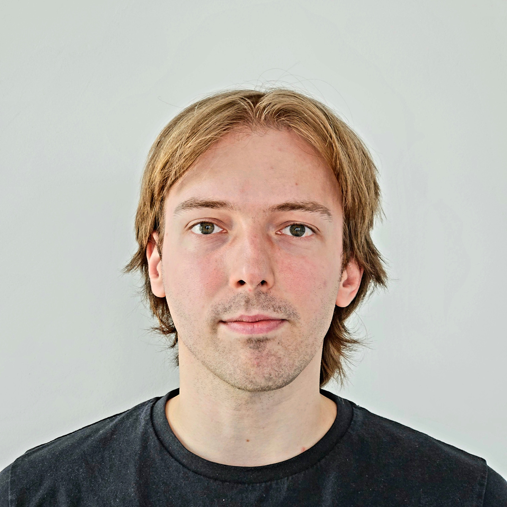
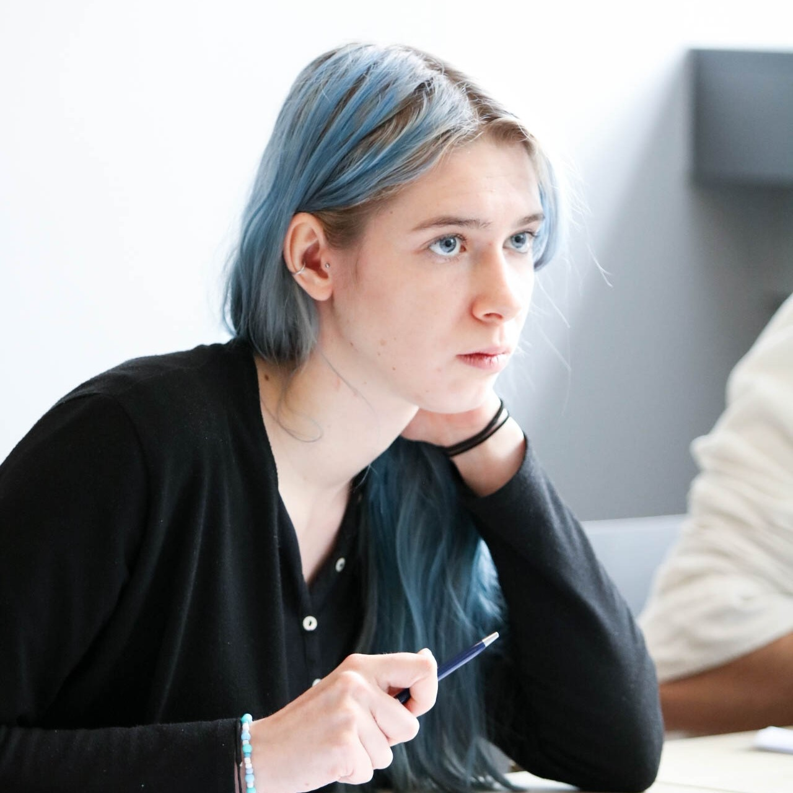
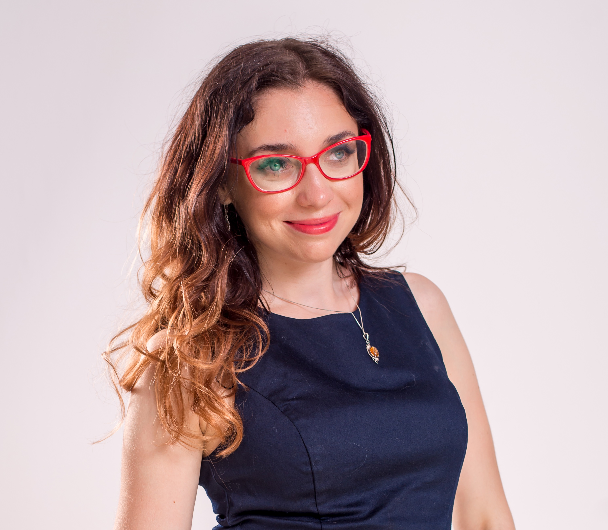
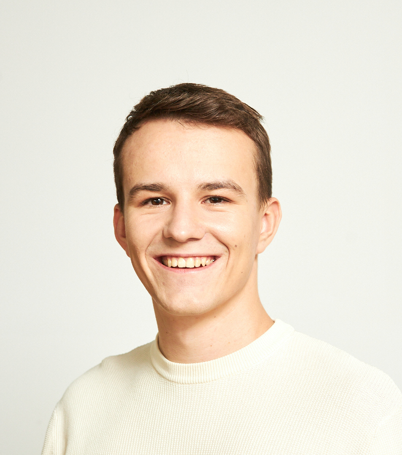
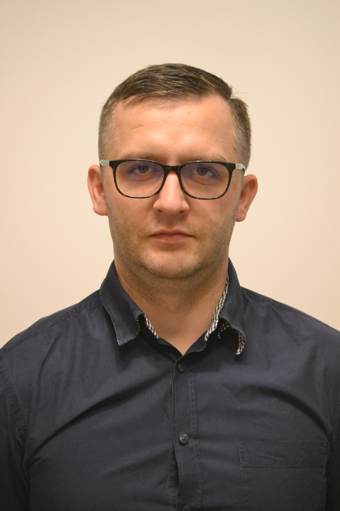
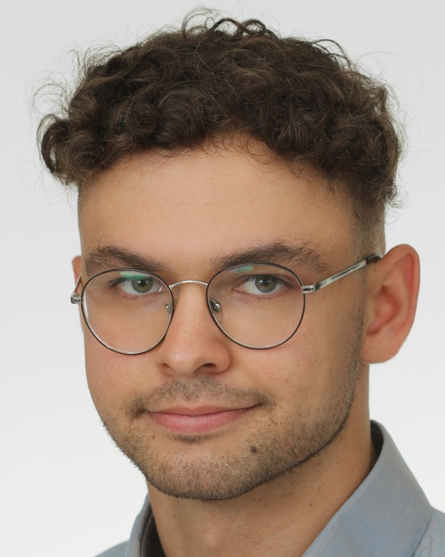

```{r setup, include=FALSE}
options(
  htmltools.dir.version = FALSE, formatR.indent = 2, width = 55, digits = 4
)
output <- knitr::opts_knit$get("rmarkdown.pandoc.to")
is.html = !is.null(output) && output == "html"
```
# MI².AI {-}
<script>
document.body.classList.add("index-page")
</script>

MI².AI is a group of mathematicians and computer scientists who love to play with predictive models.
We are spread between [Warsaw University of Technology](https://www.pw.edu.pl/engpw) and [University of Warsaw](https://en.uw.edu.pl). Here we have workshops and seminars, here we are forging new ideas, creating tools, solving problems, doing consulting and sharing our positive attitude. Feel free to jump in. 

#### Mission {-}

Machine learning is like atomic energy. **We develop leaders, skills, methods, tools and good practices so that predictive models can be deployed responsibly and sustainably**.

#### Vision {-}

MI² is a group of experts supporting global initiatives aimed at responsible and sustainable machine learning. We support the development of future leaders of responsible machine learning through internships, PhDs, postdoctoral fellowships and so on. We seek for research grants and business projects to conduct both scientific and applied research. We develop and maintain the software and infrastructure necessary to build responsible and sustainable ML. We develop cooperation with international teams working on similar topics. We support companies to implement best practices related to responsible modelling in their operation. We conduct workshops and training on responsible predictive modelling.


## The Team  {-}
<script>
document.querySelector(".page-inner section > *:first-child").classList.add("team-layout")
document.body.classList.add("team-page")
document.body.classList.add("two-columns")

 $(function() {
      // Thanks to Mark Avery
      // http://stackoverflow.com/questions/8191015/how-do-i-lay-out-my-content-divs-in-a-similar-manner-to-facebook-timeline
      var adjustArticleHeights = (function () {

        var leftColumnHeight = 0,
          rightColumnHeight = 0,
          $articles = $('.masonry > *');

        for (var i = 0; i < $articles.length; i++) {

          if (leftColumnHeight > rightColumnHeight) {
            rightColumnHeight += $articles.eq(i).addClass('right').outerHeight(true);
          } else {
            leftColumnHeight += $articles.eq(i).outerHeight(true);
          }
        }

        return $articles;
      })();
    });
</script>

<div id="team-cover-img"></div>

#### Members {-}

* [Przemysław Biecek](the-team.html#przemysław-biecek), PhD, DSc (Team Leader)
* [Hubert Baniecki](the-team.html#hubert-baniecki), PhD student
* [Mustafa Cavus](the-team.html#mustafa-cavus), PhD
* [Maciej Chrabąszcz](the-team.html#maciej-chrabąszcz), PhD student
* [Weronika Hryniewska-Guzik](the-team.html#weronika-hryniewska-guzik), PhD student
* [Mateusz Krzyziński](the-team.html#mateusz-krzyziński), MSc student
* [Tymoteusz Kwieciński](the-team.html#tymoteusz-kwiecinski), BSc student
* [Stanisław Łaniewski](the-team.html#stanisław-łaniewski), PhD student
* [Nuno Sepúlveda](https://www.immune-stats.net), PhD
* [Bartek Sobieski](the-team.html#bartek-sobieski), MSc student
* [Mikołaj Spytek](the-team.html#mikołaj-spytek), MSc student
* [Paulina Tomaszewska](the-team.html#paulina-tomaszewska), PhD student
* [Piotr Wilczyński](the-team.html#piotr-wilczyński), BSc student
* [Katarzyna Woźnica](the-team.html#katarzyna-woźnica), PhD student
* [Vladimir Zaigrajew](the-team.html#vladimir-zaigrajew), PhD student
* [Filip Kołodziejczyk](the-team.html#filip-kołodziejczyk), MSc student
* [Jakub Świstak](the-team.html#jakub-swistak), MSc student


#### Collaborators {-}

* [Mariusz Adamek](https://www.mariuszadamek.io/), Prof, MD
* Przemysław Bombiński, PhD, MD
* [André Fonseca](https://www.immune-stats.net), PhD student
* [Stanisław Giziński](the-team.html#stanisław-giziński), MSc student
* Katarzyna Kobylińska, PhD student
* [Piotr Komorowski](the-team.html#piotr-komorowski), MSc
* [Anna Kozak](the-team.html#anna-kozak), MSc
* Marcin Luckner, PhD
* [João Malato](https://www.immune-stats.net), PhD student
* [Wiktoria Mieleszczenko-Kowszewicz], PhD
* [Bartek Pieliński](the-team.html#bartosz-pieliński), PhD, DSc
* [Hanna Piotrowska](the-team.html#hanna-piotrowska), MA
* [Barbara Rychalska](the-team.html#barbara-rychalska), PhD
* Elżbieta Sienkiewicz, PhD
* [Julian Sienkiewicz](the-team.html#julian-sienkiewicz), PhD
* [Tomasz Stanisławek](the-team.html#tomasz-stanisławek), PhD
* Adrian Stańdo, MSc student
* Patryk Szatkowski, PhD student, MD
* [Emilia Wiśnios](the-team.html#emilia-wiśnios), MSc student
* [Jakub Wiśniewski](the-team.html#jakub-wiśniewski), MSc student
* [Mateusz Wójcik](the-team.html#mateusz-wójcik), MSc student

<!-- #### Summer Interns {-} -->


#### Alumni {-}

* Piotr Czarnecki, MSc
* Alicja Gosiewska, MSc
* Adrianna Grudzień, BSc
* [Mateusz Grzyb](the-team.html#mateusz-grzyb), MSc student
* [Paulina Kaczyńska](the-team.html#paulina-kaczyńska), MSc student
* Maria Kałuska, BSc
* Marcin Kosiński, MSc
* Adam Kozłowski, MSc
* Wojciech Kretowicz, BSc
* Michał Kuźba, MSc
* Szymon Maksymiuk, BSc
* Tomasz Mikołajczyk, PhD
* Katarzyna Pękala, MSc
* [Piotr Piątyszek](the-team.html#piotr-piątyszek), BSc student
* [Hubert Ruczyński](the-team.html#hubert-ruczyński), MSc student
* Adam Rydelek, BSc
* Bartosz Sawicki, BSc
* Patryk Słowakiewicz, BSc
* Michał Sokólski, MSc
* Mateusz Stączek, BSc
* Szymon Szmajdziński, BSc
* Zuzanna Trafas, BSc
* [Hoang Thien Ly](the-team.html#hoang-thien-ly), BSc
* Kinga Ułasik, BSc
* Anna Wróblewska, PhD
* [Paweł Wojciechowski](the-team.html#paweł-wojciechowski), BSc
* Hanna Zdulska, BSc
* [Artur Żółkowski](the-team.html#artur-żółkowski), BSc

<div class="masonry">

### Przemysław Biecek {-}


My personal mission is to enhance human capabilities by supporting them through access to data-driven and knowledge-based predictions. I execute it by developing methods and tools for responsible machine learning, trustworthy artificial intelligence and reliable software engineering.

I work as an associate professor at [Warsaw University of Technology](http://www.mini.pw.edu.pl/) and the [University of Warsaw](https://www.mimuw.edu.pl/). I graduated in software engineering and mathematical statistics and now work on model visualisation, explanatory model analysis, predictive modelling and data science for healthcare. In 2016, I formed the research group MI² which develops methods and tools for predictive model analysis.

Google Scholar: [Af0O75cAAAAJ](https://scholar.google.pl/citations?user=Af0O75cAAAAJ)

GitHub: [pbiecek](https://github.com/pbiecek)

LinkedIn: [pbiecek](https://www.linkedin.com/in/pbiecek/)


### Mariusz Adamek {-}


I work at two Medical Universities (Silesia and Gdańsk) holding a Professorship in Medicine and Health Sciences. My interests are focused on lung cancer prevention and screening, the latter by means of low-dose computed tomography (LDCT) with special emphasis put on molecular biology methods, prediction models and image analysis aimed to enhance the performance of lung screening outcomes.

Website: [www.mariuszadamek.io](https://www.mariuszadamek.io/)


### Hubert Baniecki {-}


I'm a PhD student in Computer Science at the University of Warsaw. Prior, I did my MSc (2022) and BSc (2021) in Data Science at Warsaw University of Technology. 
My main research interest is explainable machine learning, with particular emphasis on adversarial attacks & explanation evaluation. 

Website: [hbaniecki.com](https://hbaniecki.com/)


### Mustafa Cavus {-}


I work as an assistant professor at the [Eskisehir Technical University](https://www.eskisehir.edu.tr/). I joined the MI² DataLab as a post-doc researcher in 2021. I work on glocal explanations and imbalanced learning.

Google Scholar: [I63d1WIAAAAJ&hl](https://scholar.google.com.tr/citations?user=I63d1WIAAAAJ&hl)

GitHub: [mcavus](https://github.com/mcavs)

LinkedIn: [mcavus](https://www.linkedin.com/in/mustafacavusphd)

Twitter: [mcavus](https://twitter.com/mustafa__cavus)


### Julian Sienkiewicz {-}


I work as an assistant professor at [Faculty of Physics, WUT](https://www.fizyka.pw.edu.pl). My main research area links with sociophysics, complex networks and agent-based models. In the scope of MI² DataLab I follow my other interest - scientometrics.

Google Scholar: [mIwu11QAAAAJ](https://scholar.google.pl/citations?user=mIwu11QAAAAJ)

LinkedIn: [julek-sienkiewicz-873829](https://www.linkedin.com/in/julek-sienkiewicz-873829/)


### Maciej Chrabąszcz {-}



I am pursuing a PhD in Computer Science at Warsaw University of Technology, where I also obtained my MSc in Mathematical Statistics in 2023. My main research interests lie in the fields of responsible and explainable machine learning, with a focus on Red Teaming foundation models.

GitHub: [maciejchrabaszcz](https://github.com/maciejchrabaszcz)

LinkedIn: [maciej-chrabaszcz](https://www.linkedin.com/in/maciej-chrabaszcz/)


### Stanisław Giziński {-}


A Research Software Engineer and student of Machine Learning at Faculty of Mathematics Informatics and Mechanic, University of Warsaw. His work in the lab focuses on using natural language processing and network analysis to better understand the spread of AI public policies. Interested also in applying machine learning in bioinformatics.

Google Scholar: [Stanisław Giziński](https://scholar.google.com/citations?user=QVXc3jAAAAAJ)

GitHub: [Gizzio](https://github.com/Gizzio)

LinkedIn: [stanislaw-gizinski](https://www.linkedin.com/in/stanislaw-gizinski/)


### Mateusz Grzyb {-}


MSc student in Data Science at Warsaw University of Technology. Interested in artificial intelligence and scientific computing, but above all simply enjoys programming.

GitHub: [mgrzyb99](https://github.com/mgrzyb99)


### Weronika Hryniewska-Guzik{-}


PhD candidate in computer science at Warsaw University of Technology. Interested in deep learning modelling on medical images in the context of explainability and responsible AI.

Google Scholar: [aJeg3IQAAAAJ](https://scholar.google.pl/citations?user=aJeg3IQAAAAJ)

GitHub: [Hryniewska](https://github.com/Hryniewska)

LinkedIn: [weronikahryniewska](https://www.linkedin.com/in/weronikahryniewska)


### Paulina Kaczyńska{-}



I am working towards a Master’s degree in Machine Learning at University of Warsaw. I am interested in Natural Language Processing and ML applications in social sciences

GitHub: [Kaczyniec](https://github.com/Kaczyniec)


### Piotr Komorowski{-}


Master's student in Machine Learning at the University of Warsaw. Mainly interested in image processing and XAI applied to medical images.

GitHub: [piotr-komorowski](https://github.com/piotr-komorowski)

LinkedIn: [Piotr-Komorowski](https://www.linkedin.com/in/piotr-komorowski/)


### Anna Kozak {-}


Graduated in mathematical statistics at Warsaw University of Technology. Interested in explainable artificial intelligence and data visualization. Organizes projects related to education.

Google Scholar: [JIrqf9kAAAAJ](https://scholar.google.pl/citations?user=JIrqf9kAAAAJ)

GitHub: [kozaka93](https://github.com/kozaka93)

LinkedIn: [kozakanna](https://www.linkedin.com/in/kozakanna)
  
<!-- ### Adam Kozłowski {-}


Graduated in Computer Science at ICM at the University of Warsaw. Currently working in a lab as Research Software Engineer in xLungs. Interested in image processing, deep learning on medical images, and computation acceleration.

GitHub: [adam-kozlowski-280](https://github.com/adam-kozlowski-280)

LinkedIn: [akozowski280](https://www.linkedin.com/in/adam-kozlowski-akozowski280/) -->

  
### Mateusz Krzyziński {-}


MSc student in Data Science at Warsaw University of Technology. Interested in explainable artificial intelligence, with particular emphasis on XAI methods for survival analysis models and XAI applications in the medical field. Also an enthusiast of data visualization. 

Google Scholar: [i_r7EUgAAAAJ](https://scholar.google.com/citations?user=i_r7EUgAAAAJ)

GitHub: [krzyzinskim](https://github.com/krzyzinskim)

LinkedIn: [krzyzinskim](https://www.linkedin.com/in/krzyzinskim/)
  

### Tymoteusz Kwieciński {-}


BSc student in Data Science at Warsaw University of Technology. Particularly interested in explainable artificial intelligence, computer vision and NLP.

GitHub: [Fersoil](https://github.com/Fersoil)

LinkedIn: [Tymoteusz-Kwieciński](https://www.linkedin.com/in/tymoteuszkwiecinski/)

  
### Stanisław Łaniewski {-}


PhD student in Quantitative Psychology and Economics at University of Warsaw, Machine Learning Researcher at MI2 Data Lab, Msc in Actuarial Science and Mathematical Finance at University of Amsterdam, former Quantitative Researcher at Flow Traders
His research focuses on enhancing classical methods used in discrete choice and finance with machine learning and how to apply them to explain behavioral phenomena and heuristics. He is also keen on finding balance between best predictive models and their explainability. Avid gamer who applies statistical techniques to deepen the understanding of best strategies
  
LinkedIn: [Stanisław-Łaniewski](https://www.linkedin.com/in/stanislawlaniewski/)

### Wiktoria Mieleszczenko-Kowszewicz {-}



PhD in social science, graduated from an interdisciplinary doctoral program: information and communication technologies & psychology. Researcher interested in the use of LLMs in psychometry and developing responsible AI solutions for positive societal impact.

LinkedIn: [Wiktoria Mieleszczenko-Kowszewicz](https://www.linkedin.com/in/wiktoriakowszewicz/)
  
### Piotr Piątyszek {-}


Undergraduate Data Science student at Warsaw University of Technology. Works as a research software engineer on enhancing accessibility and completeness of explainable AI. During pandemic contributes to a system of monitoring covid variants.

Github: [piotrpiatyszek](https://github.com/piotrpiatyszek)


### Bartosz Pieliński {-}


I am an Assistant Professor at the Faculty of Political Science and International Studies at Warsaw University. I am interested in applying quantitative methods to study public policies. I am a founding member of the Institutional Grammar Research Initiative, which is focused on developing a new way of analysing social rules. I have participated in several research projects covering social policy, non-profit organizations, social enterprises, and international organizations.

Website: [https://pielinski.info/](https://pielinski.info/)

Google Scholar: [hnWiaVEAAAAJ](https://scholar.google.com/citations?user=hnWiaVEAAAAJ)

LinkedIn: [Bartosz Pieliński](https://www.linkedin.com/in/pielinski/)


### Hanna Piotrowska {-}


Information designer, focusing mainly on data visualization, branding and book design, with a strong interest in Data Science and perception studies. Winner of numerous awards, including The Kantar Information Is Beautiful Awards, HOW International Design Awards, Polish Graphic Design Awards and KTR.

LinkedIn: [hanna-piotrowska](https://www.linkedin.com/in/hanna-piotrowska-2536214b/)

Twitter: [hannapio](https://twitter.com/hannapio)

Behance: [hannapio](https://www.behance.net/hannapio).


### Hubert Ruczyński {-}


I am working towards Masters's degree in Data Science at Warsaw University of Technology. I am also teaching students about data exploration and visualisation. My major interests are: AutoML | Natural Language Processing | Data Visualization | Fairness.

GitHub: [HubertR21](https://github.com/HubertR21)
  
LinkedIn: [Hubert Ruczyński](https://www.linkedin.com/in/hubert-ruczyński-95518b218/)


### Barbara Rychalska {-}


PhD candidate in computer science at Warsaw University of Technology. Mainly interested in deep learning for natural language processing (NLP), recommender systems and graph-based learning.

Google Scholar: [Wp0wHJoAAAAJ](https://scholar.google.com/citations?user=Wp0wHJoAAAAJ)

LinkedIn: [Barbara-Rychalska](https://www.linkedin.com/in/barbara-rychalska-97825634/)

  
<!-- ### Patryk Słowakiewicz {-}
  

  
Student of Data Science at Warsaw University of Technology. Intrested in Tree-Based Machine Learning Models.

GitHub: [PSlowakiewicz](https://github.com/PSlowakiewicz)
  
LinkedIn: [Patryk Słowakiewicz](https://www.linkedin.com/in/patryk-s%C5%82owakiewicz-b0310723a/) -->


### Bartek Sobieski {-}


MSc student in Data Science at Warsaw University of Technology. Interested in deep learning and hyperparameter optimization.

GitHub: [sobieskibj](https://github.com/sobieskibj)
  
LinkedIn: [Bartłomiej-Sobieski](www.linkedin.com/in/bartłomiej-sobieski)
  

### Mikołaj Spytek {-}


  
MSc student in Data Science at Warsaw University of Technology. Interested in explainable artificial intelligence, data vizualization and survival analysis.

Google Scholar: [1u49AqYAAAAJ](https://scholar.google.com/citations?user=1u49AqYAAAAJ)
  
GitHub: [mikolajsp](https://github.com/mikolajsp)
  
LinkedIn: [Mikołaj-Spytek](https://www.linkedin.com/in/miko%C5%82aj-spytek-154760212/)
  
  
### Jakub Świstak {-}


  
MSc student in Data Science at Warsaw University of Technology. Interested in artificial intelligence, NLP and computer vision.
  
GitHub: [jswistak](https://github.com/jswistak)
  
LinkedIn: [Jakub-Świstak](https://www.linkedin.com/in/jakubswistak/)


### Tomasz Stanisławek {-}



PhD candidate in computer science at Warsaw University of Technology. Mainly interested in deep learning for natural language processing (NLP).

Google Scholar: [gq8NY_UAAAAJ](https://scholar.google.pl/citations?user=gq8NY_UAAAAJ)

GitHub: [tstanislawek](https://github.com/tstanislawek/)

LinkedIn: [Tomasz-Stanisławek](https://pl.linkedin.com/in/tomasz-stanis%C5%82awek-91092729/)


<!-- ### Mateusz Stączek {-}


BSc student in Data Science at the Warsaw University of Technology. Interested in exploring various explanation methods for image classification models and visualizing the results. 

GitHub: [mstaczek](https://github.com/mstaczek) -->


### Paulina Tomaszewska {-}


PhD candidate in Computer Science at Warsaw University of Technology. Gained experience in AI at leading universities during: Deep Learning Summer School at Tsinghua University (China), one-semester exchange at Nanyang Technological University (Singapore) and research internships at Gwangju Institute of Science and Technology (South Korea) and Institute of Science and Technology (Austria). Mainly interested in Deep Learning, Computer Vision and Transfer Learning. Recently, focused on digital pathology.

Google Scholar: [eO245iMAAAAJ](https://scholar.google.com/citations?user=eO245iMAAAAJ)

LinkedIn: [paulina-tomaszewska](https://www.linkedin.com/in/paulina-tomaszewska-2a8517109/)


### Hoang Thien Ly {-}


Bachelor student in Maths and Data Analysis at Warsaw University of Technology. Interested in working with data, and learning explainable artificial intelligence methods.

Google Scholar: [JkysewYAAAAJ](https://scholar.google.com/citations?hl=en&authuser=1&user=JkysewYAAAAJ)
  
GitHub: [lhthien09](https://github.com/lhthien09)

LinkedIn: [hthienly](https://www.linkedin.com/in/hthienly/)


### Piotr Wilczyński {-}


BSc student in Data Science at Warsaw University of Technology. Interested in Large Language Models, AI Deception and Natural Language Processing. Currently working on my thesis, which applies Computer Vision to medicine.

GitHub: [wi1lku](https://github.com/wi1lku)

LinkedIn: [Piotr-Wilczyński](https://www.linkedin.com/in/piotr-wilczy%C5%84ski-5a529320b/)
 

### Jakub Wiśniewski {-}


Research Software Engineer and third year Data Science student at Warsaw University of Technology. Developer of tools for bias detection and fairness. Currently researching responsible applications of deep learning. President of Data Science Science Club at WUT.

Google Scholar: [_6eQsXMAAAAJ](https://scholar.google.com/citations?user=_6eQsXMAAAAJ)

GitHub: [jakwisn](https://github.com/jakwisn)

LinkedIn: [jakwisn](https://www.linkedin.com/in/jakwisn)


### Emilia Wiśnios {-}


Research Software Engineer and student of Machine Learning at Faculty of Mathematics, Informatics and Mechanics, University of Warsaw. Interested in natural language processing and reinforcement learning.

GitHub: [emiliawisnios](https://github.com/emiliawisnios)

LinkedIn: [emilia-wisnios](https://www.linkedin.com/in/emilia-wisnios/)


### Paweł Wojciechowski {-}


Graduated with a bachelor's degree in Data Science from Warsaw University of Technology. Interested in explainable artificial intelligence, computer vision, and active learning.

GitHub: [p-wojciechowski](https://github.com/p-wojciechowski)

LinkedIn: [wojciechowski-p](https://www.linkedin.com/in/wojciechowski-p/)


### Katarzyna Woźnica {-}


PhD candidate in computer science at Warsaw University of Technology. Graduated in mathematical statistics. Interested in automated machine learning especially in hyperparameter tuning for tabular data. Carrying statistical analysis and predictive modelling for healthcare.

Google Scholar: [tAQS1gQAAAAJ](https://scholar.google.pl/citations?user=tAQS1gQAAAAJ)

GitHub: [woznicak](https://github.com/woznicak)

LinkedIn: [woznicak](https://www.linkedin.com/in/woznicak)


### Vladimir Zaigrajew {-}



PhD candidate in computer science at Warsaw University of Technology. Interested in deep learning, primarily on images, with a focus on representation learning.

GitHub: [WolodjaZ](https://wolodjaz.github.io)

LinkedIn: [vladimir-zaigrajew](https://www.linkedin.com/in/vladimirzaigrajew/)


### Artur Żółkowski {-}


BSc student in Data Science at Warsaw University of Technology. Interested in explainable artificial intelligence, computer vision and NLP.

GitHub: [arturzolkowski](https://github.com/arturzolkowski)

LinkedIn: [Artur-Żółkowski](https://www.linkedin.com/in/azolkowski/)

### Filip Kołodziejczyk {-}


MSc student in Data Science at Warsaw University of Technology. Interested primarly in Large Language Models. Currently researching Red Teaming of such models. At the same time, a DevOps professional.

GitHub: [FilipKolodziejczyk](https://github.com/FilipKolodziejczyk)

LinkedIn: [filip-kołodziejczyk-00](https://www.linkedin.com/in/filip-kołodziejczyk-00/)


<!-- 
### Hanna Zdulska {-}

</p>

Software engineer and Data Science BSc student at Warsaw University of Technology. Experienced in web scraping, interested in natural language processing (NLP) and legal status of Artificial Intelligence. Beginner chess players.</p>

GitHub: [HaZdula](https://github.com/hazdula)

LinkedIn: [Zdulskah](https://www.linkedin.com/in/zdulskah/)


### Bartosz Sawicki {-}


Works towards BSc degree in Data Science at Warsaw University of Technology. Interested in data visualization.

GitHub: [SawickiBartosz](https://github.com/SawickiBartosz)


### Szymon Szmajdziński {-}


Data Science student at Warsaw University of Technology. Machine learning enthusiast. Interested in automated machine learning and explainable artificial intelligence.

GitHub: [Szmajsz](https://github.com/Szmajasz)

LinkedIn: [szymszmaj](https://www.linkedin.com/in/szymszmaj/)


### Zuzanna Trafas {-}


A third-year Computer Science student at Poznan University of Technology. Interested in explainable artificial intelligence and computer vision.

GitHub: [Zuzanna-Trafas](https://github.com/Zuzanna-Trafas)

LinkedIn: [zuzanna-trafas](https://www.linkedin.com/in/zuzanna-trafas/)


### Kinga Ułasik {-}


A Data Science student at the Warsaw University of Technology. Interested in data vizualization, machine learning and programming. Besides studies, an astronomy amateur and a musician.

GitHub: [ARUMHC](https://github.com/ARUMHC)


### Maria Kałuska {-}


Pursuing a Bachelor's degree in Data Science at Warsaw University of Technology. Interested in machine learning and neural networks for computer vision.

GitHub: [kaluskam](https://github.com/kaluskam)

LinkedIn: [Maria-Kałuska](https://www.linkedin.com/in/marysia-ka%C5%82uska-ba16bb208/)


### Alicja Gosiewska {-}


PhD student in Computer Science at Warsaw University of Technology, holds a Master’s degree in Mathematics. Interested in Machine Learning benchmarks and eXplainable Artificial Intelligence for tabular data.

Google Scholar: [YiwwR6EAAAAJ](https://scholar.google.pl/citations?user=YiwwR6EAAAAJ&hl=pl)

GitHub: [agosiewska](https://github.com/agosiewska)

LinkedIn: [alicja-gosiewska](https://www.linkedin.com/in/alicja-gosiewska/)


### Michał Kuźba {-}


Data Scientist, holds a Master's degree in Computer Science from University of Warsaw. Interested in NLP, conversational explanations of AI, human aspects of Machine Learning and geographical data.  

Google Scholar: [9RU1uwcAAAAJ](https://scholar.google.com/citations?user=9RU1uwcAAAAJ)

GitHub: [kmichael08](https://github.com/kmichael08)

LinkedIn: [michalkuzba](https://www.linkedin.com/in/michalkuzba/)


### Tomasz Mikołajczyk {-}


PhD in social sciences, but in recent years has devoted himself to the area of data analysis and visualization. He is interested in the development of the area of explainable artificial intelligence.

GitHub: [tmikolajczyk](https://github.com/tmikolajczyk)

LinkedIn: [tomasz-mikolajczyk-ds](https://www.linkedin.com/in/tomasz-mikolajczyk-ds) 

### Mateusz Wójcik {-}


Machine Learning Engineer, Research Software Engineer, MSc student in Data Science with Bachelor's degree in mathematics at Warsaw University of Technology. Interested in deep learning for computer vision, geospatial data, and medical imaging. 

GitHub: [marneusz](https://github.com/marneusz)

LinkedIn: [mateusz-wójcik](https://www.linkedin.com/in/mateusz-w%C3%B3jcik-859a62264/)

-->


</div>

<!--

## Open Positions {-}


We have an open call for [HOMER](https://www.mi2.ai/research-grants.html#homer-2020-2025) and [xLungs](https://www.mi2.ai/research-grants.html#x-lungs-2021-2024) projects for following positions. If you are interested in any of them please send your CV and Motivation Letter to przemyslaw.biecek at pw.edu.pl. We reserve the right to contact only selected candidates.

### MI2 policy on benefits and obligations {-}

We are seeking highly motivated and talented researchers at different career levels to join MI2.AI research team in the exciting field of explainability and red-teaming of AI models.

There is a common recruitment policy for all positions.

We are looking for

* people interested in research who want to create methods and tools that have a real impact (not yet another paper).
* proactive people with initiative.
* people with proficiency in programming languages commonly used in AI research, at least one out of Python, R or Julia.
* solid understanding of AI/ML models, including their architecture and training processes.
* good communication skills and proficiency in academic writing; excellent problem-solving skills.

We offer:

- the opportunity to learn from experienced and motivated researchers at different career levels as well as the opportunity to work with a rich network of international and interdisciplinary collaborators (for example Harvard Medical University, Vienna University, LMU, NTU, KDD Lab, Bari University and many others).
- a possibility for a tenure-track position after the completion of the postdoc. 
- possibility to present research results at international conferences.
- access to our supercomputers, among them Eden with 32x A100 cards and 1.5TB of storage, a perfect place for training large DNN models.


**Salary**

Salary depend on experience and type of project (applied projects tend to have higher salaries than typical research projects). 

Average rates range from 50-60 PLN/hour (equivalent to 8-9.5k FTE) for a student with experience, through to 80-85 PLN/hour (equivalent to 12-13k FTE) for an experienced PhD student. The base salary for a post-doc (no obligatory teaching duties) is 120-140k gross per year (this is a base salary, extras depend on activity).

### Low commitment projects (1/5 FTE) in 2023 {-}

Ex 1: Any object can be embedded with an appropriately trained neural network. But can objects be embedded using tree-based models? This project (an ideal candidate for MSc thesis) is about exploring different embedding construction techniques based on random forest or boosting methods.

Ex 2:  Analysis of champion-challenger model pairs on subsets of observations obtained using data segmentation. The project consists of an extension of the EPP method (Elo for predictive models) based on segmented data (e.g. by k-means or by random splits). In addition to the performance analysis, a PD profile comparison analysis is also performed on the splits.

### Mid commitment projects (2-2.5/5 FTE) in 2023 {-}

Ex 1: Development of techniques for explaining segmentation models for 1d (feature-producing models, e.g. survival models), 2d (image-producing models) or 3d data. (CT, hyperspectral images) Experience and knowledge of classical explanatory techniques (SHAP, LRP, CRP) are desirable.

Ex 2:  Development of red-teaming techniques for LLaMA 2-type language models. Development of test suites testing the vulnerability of the model to a set of prompting-based attacks.


### Full-time positions for post-docs in 2023 {-}


In addition to the research tasks listed above, responsibilities include mentoring junior staff (students, PhD students) and leading small research groups.

**Additional information about costs of living in Warsaw**

[From FENS](https://fens.org.pl/en/job-offers/):
Warsaw is the capital of Poland, so in principle it is one of the most expensive cities in the country but living in Warsaw is still much cheaper than in the majority of European cities. In general, a single person in Warsaw is able to cover all necessary expenses (flat, media, transport, food) with ca. 5000-5500 PLN per month. A typical cost of renting a 2-room flat (30-40 square meters) varies between 2000-3000 PLN, depending on the part of the city. Electricity and media (TV, Internet) are usually not included in the rent and have to be paid separately. The cost of the lunch in the vicinity of the main campus of WUT is ca. 25-40 PLN, while a monthly ticket for public transport is 110 or 180 PLN depending on the area of validity. Public health insurance is included in the post (this includes also admission to hospitals), however the medicines are paid separately.


### Research Software Engineer {-}

In addition to research positions, we also offer positions for skilled programmers.

**Required:**

* Background in Computer Science, Mathematics, Statistics or similar. 
* Experience in Computer Vision or NLP models

**Scope of work:**

* Training of machine learning models for tabular and image data
* Interpretable solutions for tabular and image data
* Responsible ML solutions for the healthcare domain


<!--
  
I am looking for a post-doc to join the MI2.AI team for one or two years within [HOMER](https://www.mi2.ai/research-grants.html#homer-2020-2025) project.
The ideal fit is someone with (experience in Medical Image Analysis with deep learning models) OR (someone with experience in AutoML for tabular data).
Experience or interest in **XAI** / **fairness** will always be a huge plus in our team.

We have a young and very energetic team focused on growth in AI. Full time position. Salary above academic average. Little or no didactics. Strong focus on doing things that are **meaningful**.

**Required:**

* PhD in Computer Science, Mathematics, Statistics or similar. (Different background? We encourage cross-domain short research visits).
* Experience in Scientific Programming (R and/or Python and/or C++)
* Good track of Scientific Records

**Scope of work:**

* Automated model exploration
* Interpretable measures for model performance
* Meta/transfer learning in automated model development
* Automated model validation
* Experiments with XAI for deep learning

**Offer:**

* Excellent atmosphere for work in a young and very active ML lab
* Conferences and training budget
* Short visits in cooperating abroad group
* Access to CPU / GPU clusters
* Full-time job at Warsaw University of Technology
* plus results-driven extras
* contract for 6 months (short visit) / 12 months or 24 months (long visit)

<!-- ### ARES {-}

PhD position funded by the PRELUDIUM BIS grant ARES (*Attack-Resistant Explanations toward Secure and trustworthy AI*).

Machine learning explainability, fairness, robustness, and security are critical elements of trustworthy Artificial Intelligence, an area of strategic importance. The main goals:

* develop adversarial attacks on state-of-the-art explanations to investigate  vulnerabilities and limitations of the existing explainability and fairness approaches  in machine learning, and
* introduce novel robust explanations that are stable against manipulation and intuitive to evaluate.

These are targeted at progressing responsible machine learning toward a secure and trustworthy adoption of AI solutions. 

**Join us, and change the way how ML models will be explained and evaluated.**

 -->


## Contact {-}

Our rooms: 

* 44 (DataLab - separate entrance in front of the main entrance)
* 316 (xLungs)
* 317 (HOMER) 


Faculty of Mathematics and Information Science,

Warsaw University of Technology,

Koszykowa 75,

00-662 Warszawa

VAT: PL 5250005834


<iframe src="https://www.google.com/maps/embed?pb=!1m18!1m12!1m3!1d2444.1647099791685!2d21.005092115735344!3d52.
22222527975892!2m3!1f0!2f0!3f0!3m2!1i1024!2i768!4f13.1!3m3!1m2!1s0x471ecd5d7938e739%3A0x64ab06034e05e767!
2sMI2%20DataLab!5e0!3m2!1spl!2spl!4v1622669807972!5m2!1spl!2spl" width="900px" height="600" style="border:0;"
allowfullscreen="" loading="lazy"></iframe>

<script>
document.body.classList.add("contact-page")
</script>
